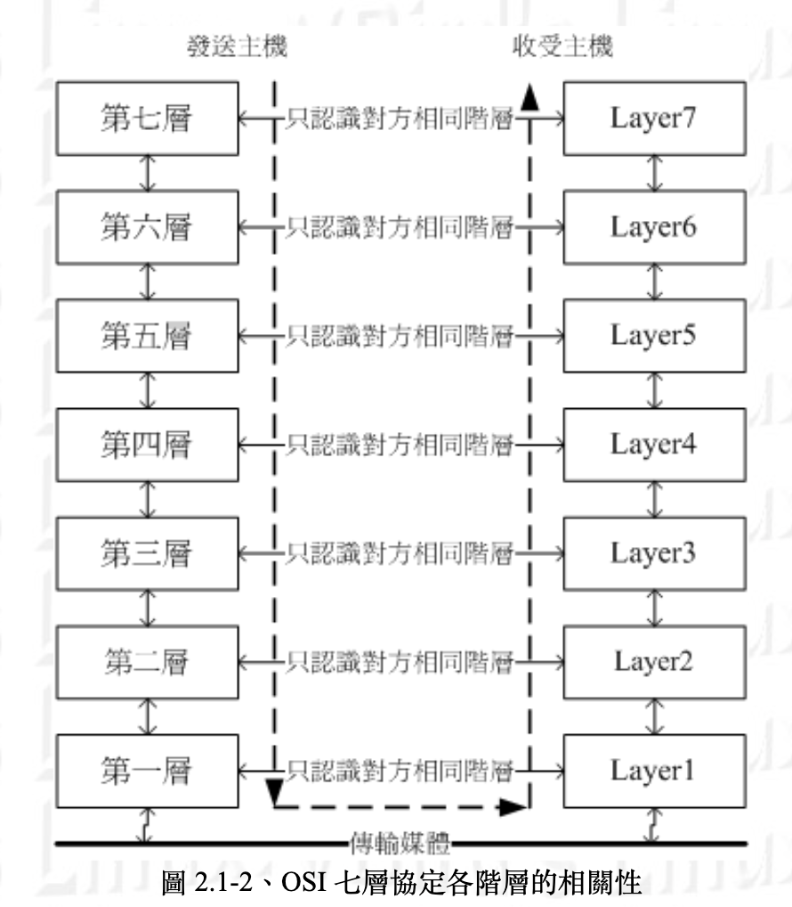
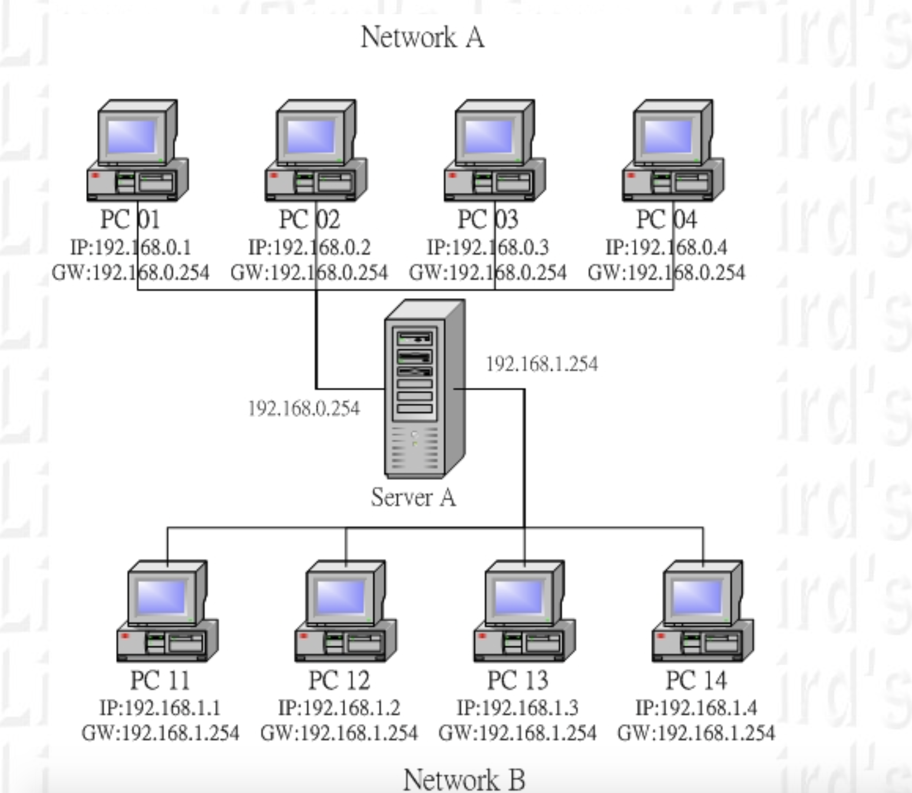
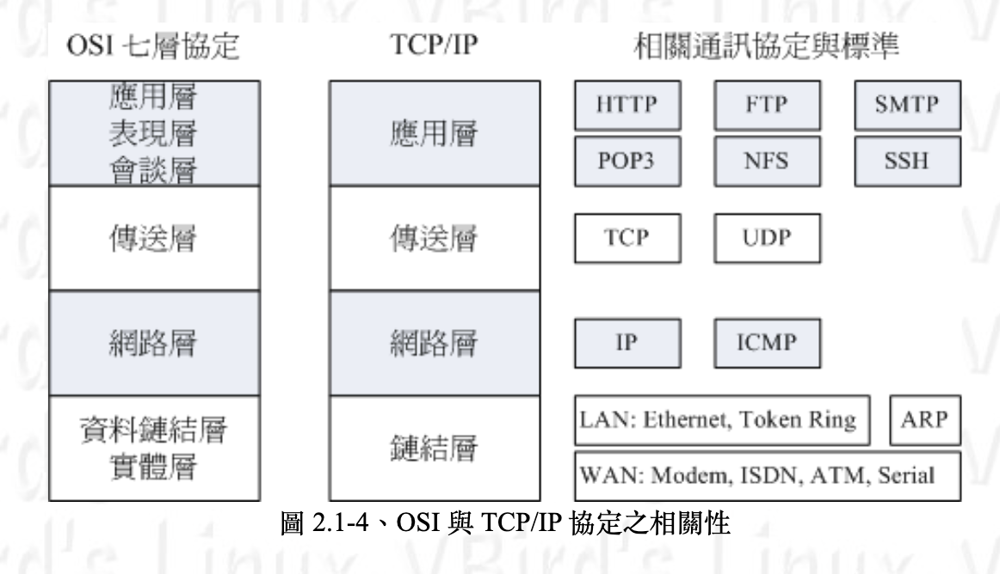
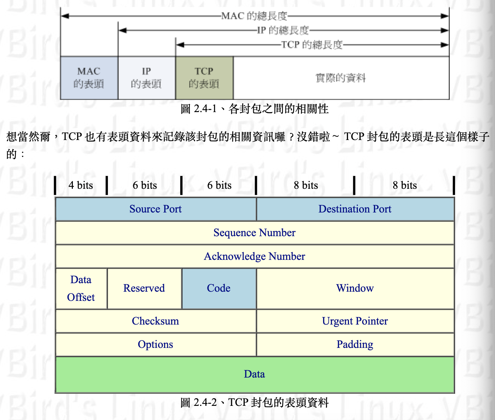
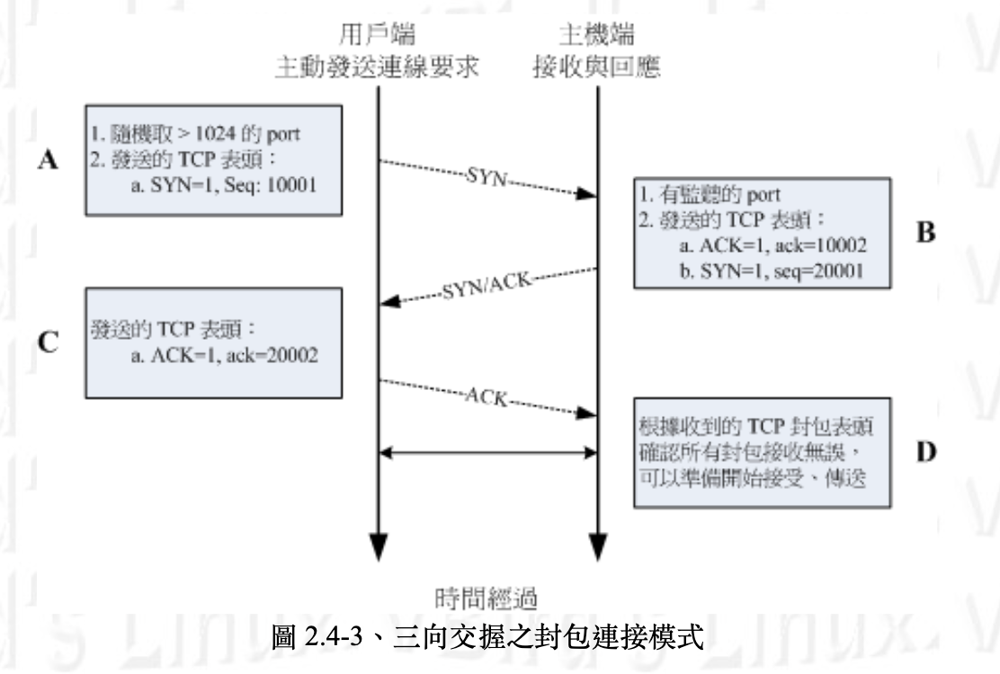

# Ref

[鳥哥](http://linux.vbird.org/linux_server/0110network_basic.php#whatisnetwork_osi)

[http wiki](https://zh.wikipedia.org/wiki/%E8%B6%85%E6%96%87%E6%9C%AC%E4%BC%A0%E8%BE%93%E5%8D%8F%E8%AE%AE)

[mqtt wiki](https://zh.wikipedia.org/wiki/MQTT)

[dns wiki](https://zh.wikipedia.org/wiki/%E5%9F%9F%E5%90%8D%E7%B3%BB%E7%BB%9F)

[isp wiki](https://zh.wikipedia.org/wiki/%E4%BA%92%E8%81%94%E7%BD%91%E6%9C%8D%E5%8A%A1%E4%BE%9B%E5%BA%94%E5%95%86)

# Outline

* OSI 七層協定
* 什麼是路由? (route)
* 電腦網路通訊協定 TCP/IP 
* TCP/IP 鏈結層相關協定
* TCP/IP 網路層相關封包與資料
* TCP/IP 傳輸層相關封包與資料
* 通訊埠口(ports)
* 特權埠口 (privileged ports)
* Socket pair 
* TCP的三向交握
* UDP
* DNS and ISP
* 那些應用層協定們
* http
* mqtt
* rtsp

# OSI 七層協定

標準通訊協定有7層，稱之為OSI七層協定(Open System Interconnection)，每一層都可以透過程式碼實作

</img>

越底層越靠近硬體，越上層越靠近應用服務，IP(Internect Protocol)被定義在第3層(Network Layer)，該層定義了電腦連線的建立、維持、終止、資料封包的傳輸路徑等，這個層級有兩個重要概念，IP以及路由(route)

## 什麼是路由? (route)

Gateway / Router ：網關/路由器的功能就是在負責不同網域之間的封包轉遞 (IP Forwarding)，由於路由器具有 IP Forwarding 的功能，並且具有管理路由的能力， 所以可以將來自不同網域之間的封包進行轉遞的功能。此外，你的主機與你主機設定的 Gateway 必定是在同一個網段內喔！

</img>

上圖的server A 就是路由，就是轉接站的意思

**OSI七層協定作為網路的概念教學可以解釋得很好，但是實務上的網路實作程式碼，都是使用TCP/IP**

## 電腦網路通訊協定 TCP/IP

OSI七層協定架構非常嚴謹，所以很難寫，開發上會很有困擾，TCP/IP將其簡化為4層

</img>

以上可以看過我們熟悉的名詞，IP在網路層，TCP，UDP在傳送層，HTTP, FTP, SSH, SMTP在應用層

``` 

那 TCP/IP 是如何運作的呢？我們就拿妳常常連上的 Yahoo 入口網站來做個說明好了，整個連線的狀態可以這樣看：

應用程式階段：妳打開瀏覽器，在瀏覽器上面輸入網址列，按下 [Enter]。此時網址列與相關資料會被瀏覽器包成一個資料， 並向下傳給 TCP/IP 的應用層；
應用層：由應用層提供的 HTTP 通訊協定，將來自瀏覽器的資料包起來，並給予一個應用層表頭，再向傳送層丟去；
傳送層：由於 HTTP 為可靠連線，因此將該資料丟入 TCP 封包內，並給予一個 TCP 封包的表頭，向網路層丟去；
網路層：將 TCP 包裹包進 IP 封包內，再給予一個 IP 表頭 (主要就是來源與目標的 IP 囉)，向鏈結層丟去；
鏈結層：如果使用乙太網路時，此時 IP 會依據 CSMA/CD 的標準，包裹到 MAC 訊框中，並給予 MAC 表頭，再轉成位元串後， 利用傳輸媒體傳送到遠端主機上。

```

## TCP/IP 鏈結層相關協定

最底層和硬體比較有關係，包含像是WAN, LAN的硬體，以及CSMA/CD乙太網路協定，MAC訊匡格式等

## TCP/IP 網路層相關封包與資料

### 硬體

要有網路還必須要有網路相關硬體，現在最常見的網路硬體介面為乙太網路，包含網路線，網路卡，Hub/Switch，網路卡卡號為基準的MAC訊匡，配合CSMA/CD標準來傳送訊匡

### 軟體

Internet就是TCP/IP這個通訊協定的通稱

## TCP/IP 傳輸層相關封包與資料

</img>

真正的data外面還包了header，TCP的header如上

| item                    | means                                                               | note  |
|-------------------------|---------------------------------------------------------------------|-------|
| source and destination  | 從哪來，去哪裏                                                         | |
| sequence number(封包序號) | TCP資料太大時(大於IP封包的容許程度)，就要進行分段，Sequence number就是封包序號 |       |
Acknowledge number(回應序號)|為了確認主機端確實有收到client端發出的封包資料，client希望能夠收到主機端的回應，當client收到這個確認碼時，就能夠確定之前傳遞的封包被正確地收下||
...|...||

### 通訊埠口(port)

這麼說你或許不好理解，我們換個說法好了。假如 IP 是網路世界的門牌，那麼這個埠口就是那個門牌號碼上建築物的樓層！ 每個建築物都有 1~65535 層樓，你需要什麼網路服務，就得要去該對應的樓層取得正確的資料。但那個樓層裡面有沒有人在服務你呢？ 這就得要看有沒有程式真的在執行啦。所以，IP 是門牌，TCP 是樓層，真正提供服務的， 是在該樓層的那個人 (程式)！

#### 特權埠口 (privileged ports)

公定好的特約ports(專門給系統服務使用)

| port number | service                                      | note  |
|-------------|----------------------------------------------|-------|
| 20          | FTP，檔案傳輸協定                               | |
| 21          | FTP，檔案傳輸協定的命令通道                      |       |
| 22          | SSH，較為安全的遠端連線伺服器                     |       |
| 23          | Telnet，早期的遠端連線伺服器軟體                  |       |
| 25          | SMTP，簡單郵件傳遞協定，用在作為 mail server 的埠口 |       |
| 53          | DNS，用在作為名稱解析的領域名稱伺服器              |       |
| 80          | WWW，這個重要吧！就是全球資訊網伺服器               |       |
| 110         | POP3，郵件收信協定，辦公室用的收信軟體都是透過他     |       |
| 443         | https，有安全加密機制的WWW伺服器                 |       |

#### Socket pair

網路是雙向的，來源地的IP + port加上目的地的IP + port稱作socket pair

由於 IP 與埠口常常連在一起說明，因此網路定址常常使用『 IP:port 』來說明，例如想要連上鳥哥的網站時， 正確的鳥哥網站寫法應該是：『 linux.vbird.org:80 』才對！

### TCP的三向交握

可靠的連線封包協定

TCP(Three-way handshake) - 俗稱的三次揮手

鳥哥上課談到 TCP 最常做的事就是，叫一個同學起來，實際表演三向交握給大家看！

1. 鳥哥說：A同學你在不在？
2. A同學說：我在！那鳥哥你在不在？
3. 鳥哥說：我也在

此時兩個人就確認彼此都可以聽到對方在講啥，這就是可靠連線啦！ ^_^

</img>

## UDP

非連結導向的UDP協定(User Datagram Protocol)用戶資料流協定

那麼上課時怎麼介紹 UDP 呢？很簡單喔！鳥哥就會說：『現在老師就是在進行 UDP 的傳送，因為老師一直講一直講， 俺也沒有注意到你有沒有聽到，也不需要等待你的回應封包！就這樣一直講！當然，你沒有聽到鳥哥講啥，我也不會知道...』

TCP 封包確實是比較可靠的，因為通過三向交握嘛！不過，也由於三向交握的緣故， TCP 封包的傳輸速度會較慢。 至於 UDP 封包由於不需要確認對方是否有正確的收到資料，故表頭資料較少，所以 UDP 就可以在 Data 處填入更多的資料了。同時 UDP 比較適合需要即時反應的一些資料流，例如影像即時傳送軟體等， 就可以使用這類的封包傳送。也就是說， UDP 傳輸協定並不考慮連線要求、連線終止與流量控制等特性， 所以使用的時機是當資料的正確性不很重要的情況，例如網路攝影機！

另外，很多的軟體其實是同時提供 TCP 與 UDP 的傳輸協定的，舉例來說，查詢主機名稱的 DNS 服務就同時提供了 UDP/TCP 協定。由於 UDP 較為快速，所以我們 client 端可以先使用 UDP 來與伺服器連線。 但是當使用 UDP 連線卻還是無法取得正確的資料時，便轉換為較為可靠的 TCP 傳輸協定來進行資料的傳輸囉。 這樣可以同時兼顧快速與可靠的傳輸說！

# DNS and ISP

為啥你不是用IP位置+port上網?
其實你是，只是有個系統把IP + port的數字換掉了，這個系統稱作Domain Name System(DNS)具體來說如下 ：

像鳥哥我常常會連到奇摩雅虎的 WWW 網站去看最新的新聞，那麼我一定需要將奇摩雅虎的 WWW 網站的 IP 背下來嗎？天吶， 鳥哥的忘性這麼好，怎麼可能將 IP 背下來？！不過，如果是要將奇摩站的主機名稱背下來的話， 那就容易的多了！不就是 http://tw.yahoo.com 嗎？而既然電腦主機只認識 IP 而已， 因此當我在瀏覽器上面輸入了『http://tw.yahoo.com』的時後，我的電腦首先就會藉由向 DNS 主機查詢 tw.yahoo.com 的 IP 後，再將查詢到的 IP 結果回應給我的瀏覽器， 那麼我的瀏覽器就可以藉由該 IP 來連接上主機啦！

DNS在哪? 

只要有一個地方maintain這個ip -> link name 的table就好，不用大家都有，以台灣來說應該會放在中華電信(ISP - 網際網路服務供應商(Internet Service Provider))

# 那些應用層協定們

## HTTP

超文本傳輸協定(HyperText Transfer Protocol)，最初是為了提供一種發布和接收HTML頁面的網路傳輸協定

http是應用層協定，通訊層使用TCP(也就是三項交握的可靠傳輸協定)，最初用來傳網頁，現在不只會傳html，還會傳js code，圖片，甚至一個影片串流等，HTTP也有自己的header，規定好的狀態碼

和TCP的比較，TCP只確保了可靠連線，要傳什麼可以自己刻，HTTP則有自己的header，通常拿來傳整張網頁，看裡面要放什麼

## MQTT

[here](https://zh.wikipedia.org/wiki/MQTT)

[home camera](https://www.pyimagesearch.com/2019/04/15/live-video-streaming-over-network-with-opencv-and-imagezmq/)

## RTSP
