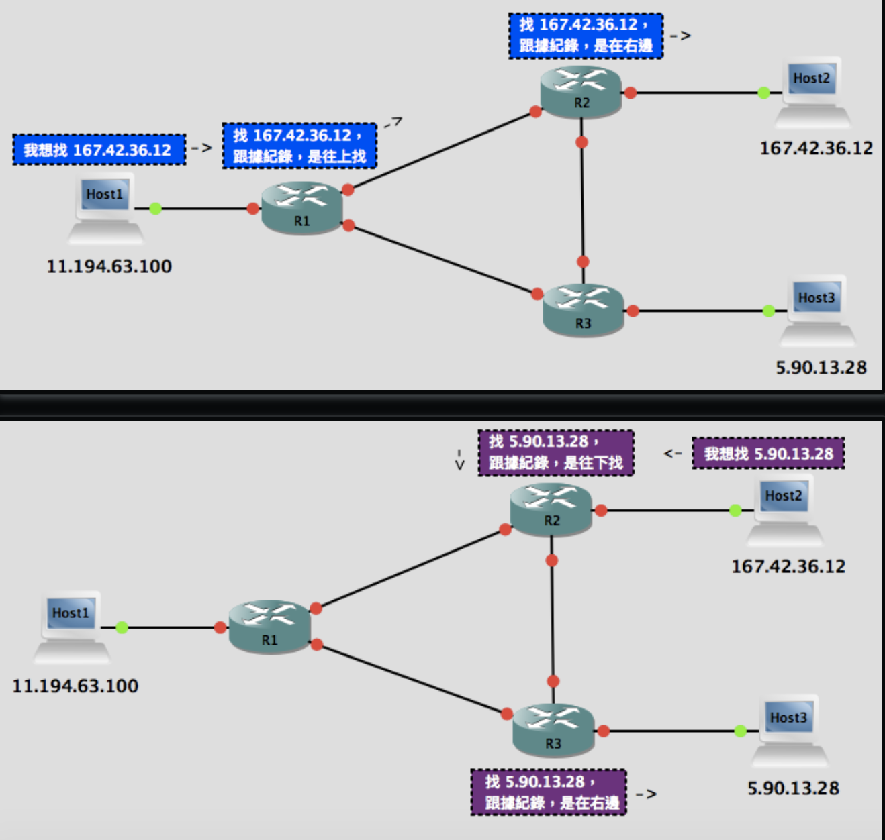
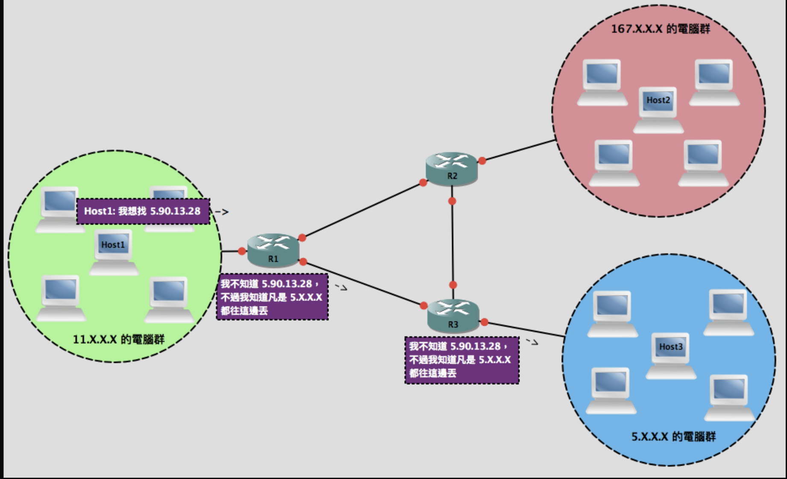
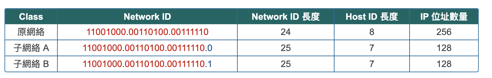

# Ref

[IP Address Version 4 IPv4 and route](https://www.jannet.hk/zh-Hant/post/IP-Address-Version-4-IPv4/)

# History of IP address and subnetwork mask

## Network ID

IPv4 : 11.194.63.100 -> 00001011.11000010.00111111.01100100 -> 00001011110000100011111101100100

一般來說任一台連上網路的電腦、電話、平板、隱形井頭都要有獨一無二的IP Address，如果雙方要進行溝通，就必須知道對方的IP Address，然而雙方並不是直接連線的，我知道對方的IP Address之後這個溝通是怎麼發生的？ 答案是路由器 Router

### Router

a.k.a. 快遞公司

</img>

上圖是一個超濃縮版，世界上有成千上萬個Router去應付百萬千萬台電腦，然而以上方法豈不是要記錄百萬千萬台電腦的IP Address以及相對位置?

例如R1要記著167.42.36.12, 5.90.13.28, 167.24.23.53, 167.63.75.112

勁量把頭一組數字相同的電腦放在一起，這樣Router只要紀錄同一堆電腦的第一組數字而不需要紀錄世界上一台電腦的IP

</img>

透過以上方法，IP Address就能夠有系統地分派給不同公司或是組織，為了分辨清楚，首8個bits稱為NetworkID，尾24Bits稱為Host ID

例如 11.194.63.100

Network ID : 11
Host ID : 194.63.100 

但是以上分配方法太多Host，太少Network，不如我們把NetworkID弄大一點

| type    | explanation   | length of network id | length of host id | num of ip address    |
|---------|---------------|----------------------|-------------------|-----|-------|
| Class A | first bit 0, 8 bits Network ID                       | 8   |   24     |  16777216   |
| Class B | first and second bits 10, 16 bits Network ID         | 16    |    16     |  65536   |
| Class C | first, second and third bits 110, 24 bits Network ID | 24    |     8         |   256  |

以上做法稱作Classful Network!
支援Classful Network的Routing Protocol稱作Classful Routing Protocol，例如RIPv1和IGRP

# Subnet Mask(子網路遮罩)

Classful Network供不應求，只有3種class無法應應彈性化的ip address規劃，又有電腦專家跳出來，說，啊不然讓大家自訂，例如

200.52.62.0(11001000.00110100.001111110.00000000) Class C network，Network ID 長度24，可容納256個IP Address，如果多加一個bit的network id，變成25個bit，那麼ip數量就會從256降到128

</img>

然而我們要怎麼知道現在規格是什麼? Classful不能用了!

這時電腦科學專家定義了子網路遮罩，用於辨別現在哪些bits屬於NetworkID，哪些屬於HostID

定義NetworkID = IP Address in binary && Subnet Mask

例如

host 1 : 192.168.0.11

host 2 : 192.168.1.66

subnet mask : 255.255.255.0

network id of host 1 : (192.168.0.11 in binary) && (255.255.255.0 in binary) = 192.168.0.0
network id of host 2 : (192.168.1.66 in binary) && (255.255.255.0 in binary) = 192.168.1.0

因此當我們想要表示一個子網路A的IP Address，我們會連同子網路遮罩一起表示

例如 host 1 : `192.168.0.11/255.255.255.0`

## short format of subnet mask

每次都寫 `192.168.0.11255.255.255.0` 其實很煩，而且大部分時候很多公司的網路工程師還是採用255.255.255.0的網路遮罩來分割公司的網路，因此又推出了一個縮寫版

直接寫出subnet mask bit 1的數量

例如255.255.255.0 -> 11111111.11111111.11111111.00000000 -> /24

如果是255.252.0.0 -> 11111111.1111100.00000000.00000000 -> /14

這種寫法被稱作Prefix!

所以我們可以這樣寫 `192.168.0.176/24`

# Supernet

# VLSM

# Private IP Address
