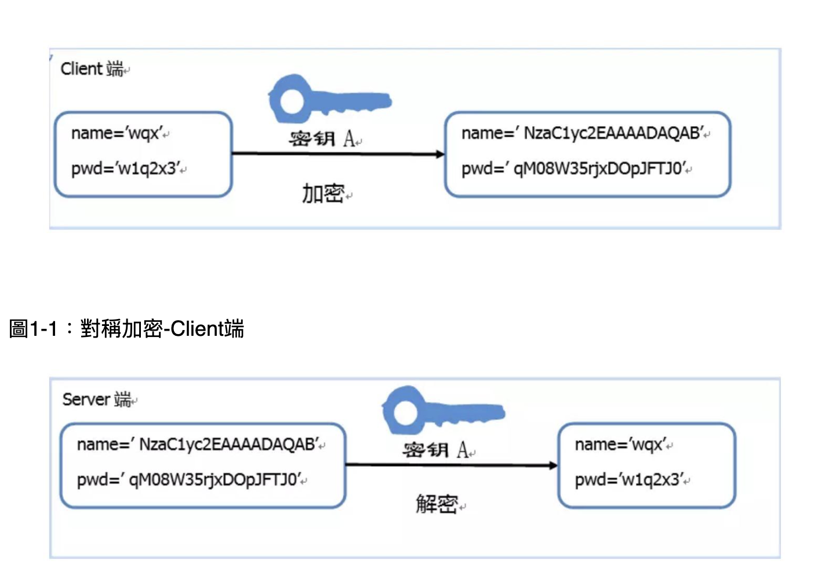
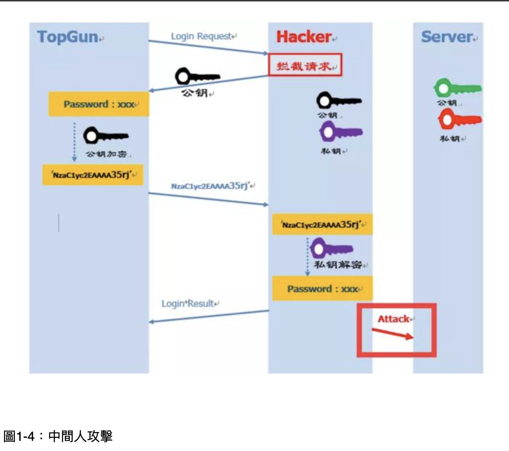
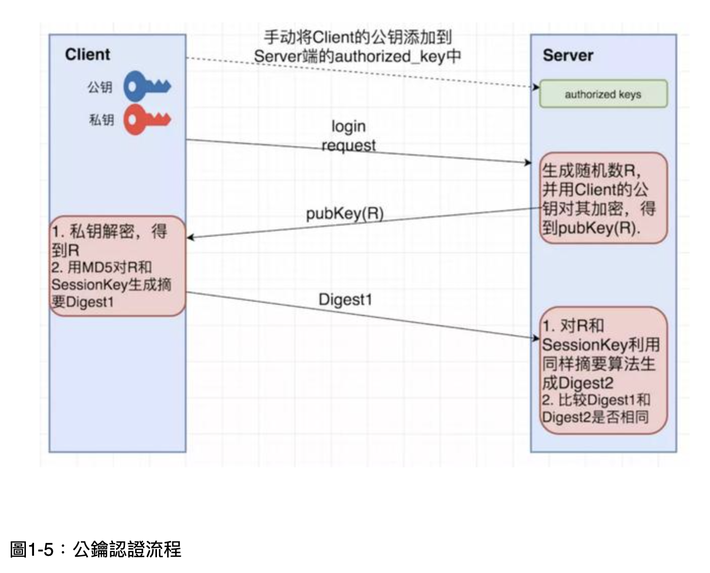
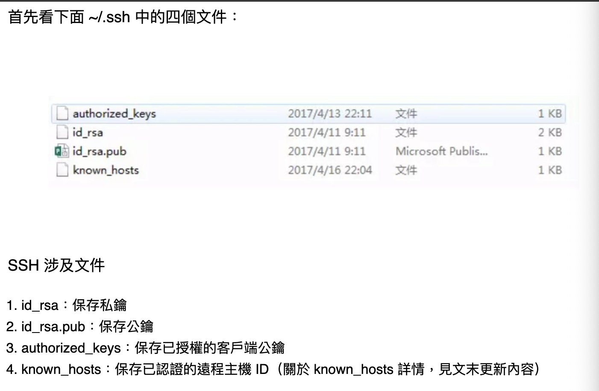
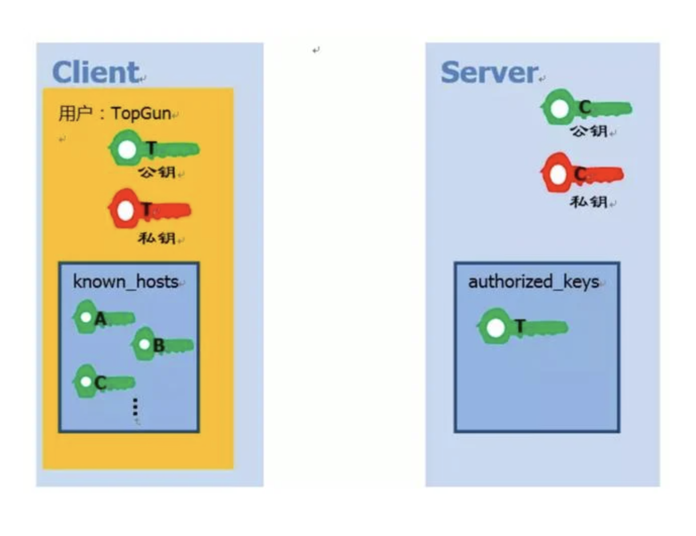

# Why ssh

Secure Shell - (ssh)

為什麼要搞這麼個協議呢？其實，很久很久以前，網際網路通信都是明文的，一旦在中間環節被某些中間商截獲了，我們的通信內容就暴漏無疑。

所以芬蘭就有這麼一位叫做 Tatu Ylonen 的人設計了 SSH 協議，將信息加密，這樣就像上面說的，即使我們的登陸信息在中間被人截獲了，我們的密碼也不會被泄露。

目前 SSH 協議已經在全世界廣泛被使用，且已經在成為各個 Linux 發行版的標配。

SSH是一種協議標準，用於在網絡主機之間進行加密的一種協議，其目的是實現安全遠程登錄以及其它安全網絡服務。

SSH 僅僅是一協議標準，其具體的實現有很多，既有開源實現的 OpenSSH，也有商業實現方案。使用範圍最廣泛的當然是開源實現 OpenSSH。

# How ssh 

ssh和telnet, ftp等協議的主要區別在於安全性，如何實現安全性呢?

## 對稱加密(密鑰加密)

</img>

優點

1. 強度高
2. 難破解

缺點

較難安全的保存鑰匙，因為可能存在大量client，被幹走一把鑰匙就能夠在server解密使用者名稱和密碼

因此產生了非對稱加密

## 非對稱加密(公鑰加密)

</img>

1. 遠端Server收到Client(TopGun)的登錄請求，Server將公鑰發給TopGun
2. Client使用公鑰，加密碼加密
3. Client將加密密碼送給Server
4. Server用私鑰解密登錄密碼，並驗證合法性
5. 給予Client相應的回覆

仍然是有問題的 : 

攻擊者可以攔截登入請求，此手法稱之為中間人攻擊: 

</img>

Hacker可做為一個假Server，攔截client請求，但client看其名字顯示是Server，順利取得密碼

### ssh的處理方式

#### 口令認證

口令認證 - client第一次登錄server時，會出現以下提示訊息

``` 

The authenticity of host 'ssh-server.example.com (12.18.429.21)' can't be established.

RSA key fingerprint is 98:2e:d7:e0:de:9f:ac:67:28:c2:42:2d:37:16:58:4d.

Are you sure you want to continue connecting (yes/no)?
```

意思是說 無法確認主機 ssh-server.example.com(12.18.428.21)的真實性，不過我們知道他的公鑰指紋，要連接嗎?

> 之所以會用fingerprint代替key是因為 RSA算法生成的公鑰有1024位，很難直接比較，所以對公鑰hash生成一個128位的指紋，比較方便比較

如果輸入 `yes` 之後，就會出現下面訊息

``` 

Warning: Permanently added 'ssh-server.example.com,12.18.429.21' (RSA) to the list of known hosts.

Password: (enter password)
```

該host已被確認，並被追加到文件known_hosts中

#### 公鑰認證

每次登入都問client端說該server是否可以信任，很煩，所以client要是信任server，就把公鑰丟到server上吧

</img> 

1. Client將自己的公鑰存放到Server上，並追加在authorized_keys中(authorized_key)不是資料夾，而是文字檔，注意Client端是透過key generator產生自己client的公私鑰，並且手動複製到server端，ssh建立連接的過程沒有公鑰的操作
2. Server端收到client端的連接請求，並在authorized_keys匹配到client的公鑰pubKey，並生成隨機數R，用client的公鑰對隨機數加密得到public(R)，將加密訊賢傳給client
3. client端透過私鑰解密的到隨機數R，再透過本次會話的SessionKey利用MD5生成摘要Digest1，發送給Server
4. Server 端會也會對 R 和 SessionKey 利用同樣摘要算法生成 Digest2。
5. Server 端會最後比較 Digest1 和 Digest2 是否相同，完成認證過程。

### 實踐

使用ssh-keygen

1. `ssh-keygen -t rsa -P '' -f ~/.ssh/id_rsa` 生成鑰匙，並放在.ssh/id_rsa裡面，會有兩把鑰匙，公鑰和私鑰
2. `cat ~/.ssh/id_rsa.pub >> ~/.ssh/authorized_keys` - 放到authorized_key，之後丟到server上方便
3. `chmod 0600 ~/.ssh/authorized_keys` - 修改權限

</img> 

</img> 

需要注意的一點是，一台主機可能既是client也是server，所以會同時擁有authorized_keys和known_hosts

### ssh config and command line

1. [command line] `-v` verbose mode : 可以窺探在連線時發生什麼事，e.g. debug使用，了解為什麼連不上去
2. [command line] `-i` identify file : 使用哪一把私鑰進行加密，預設會找 `~/.ssh/id_dsa`,    `~/.ssh/id_ecdsa`,    `~/.ssh/id_ed25519` `~/.ssh/id_rsa.`，如果都沒有就會報錯，或是要輸入 -i private_key_name，也可以在ssh config中加入
3. [config] ForwardAgent : 若跳板到遠端機器，又要使用其他需要鑰匙的服務，本地端機器和遠端機器都上傳鑰匙是一件很麻煩的事情，ForwardAgent設定成yes，就只會找登入的那台機器的鑰匙，非常方便，需再登入端輸入`ssh-add`，將自己的鑰匙包加入環境變數

# Reference

[圖解 SSH 原理](https://kknews.cc/zh-tw/code/34mlvqg.html)

[RSA加密演算法](https://zh.wikipedia.org/zh-tw/RSA%E5%8A%A0%E5%AF%86%E6%BC%94%E7%AE%97%E6%B3%95)
