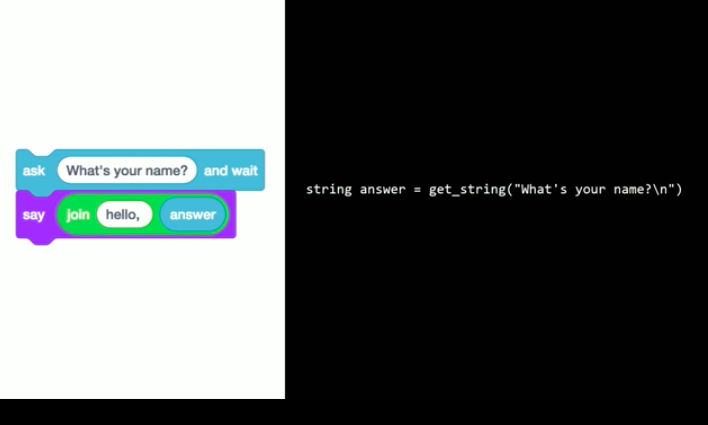
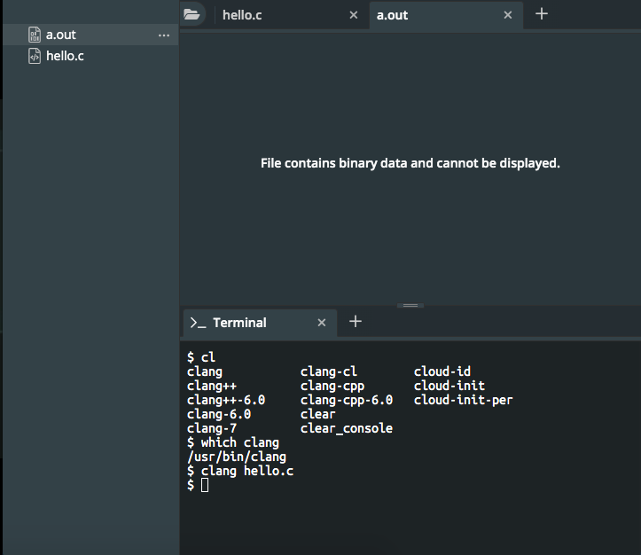
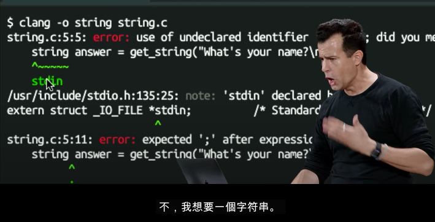
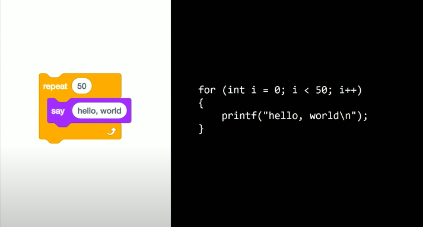
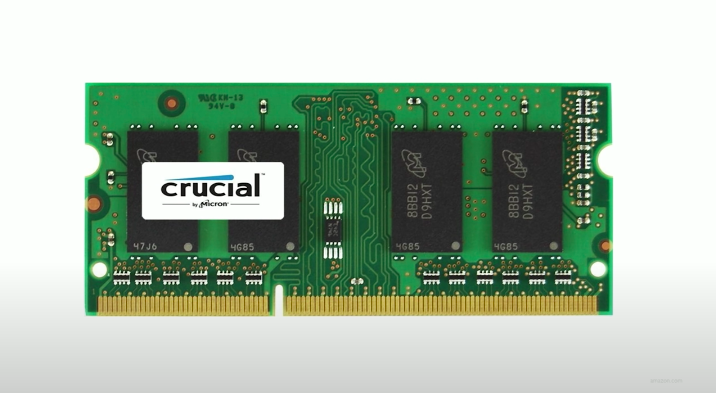

# Ref

[Home page](https://cs50.harvard.edu/summer/2020/weeks/1/)

[pdf](https://cdn.cs50.net/2019/fall/lectures/1/lecture1.pdf)

# C

* 傳統，古老，純粹基於文本
* 他可以做所有Scratch做得到的，甚至做到更多，但是沒有什麼使用者有好性QQ
* 你或許沒有經驗，但是其中2/3的人也都沒有
* 雖然程式碼的長相不一樣，但是背後的觀念絕對是跟Scratch完全一模一樣

</img>

* 這堂課會帶給你一種MIT的Hacker精神，就像是被消防水柱炸臉一樣，帶給你的知識會比你能接收的還要多，但在課程結束後你會覺得非常值得

</img>

* actually the same

</img>

* for starting things
* 右邊你可能目前還不知道在幹嘛，但是幾堂課之後你會逐漸了解
* `printf` - print in format
* using double quote to pack your string
* when you finish your thought, add `;`
* then, `printf("hello, world");`
</img>

* `include <studio.h>`
* if you want to use some functionality, you need to tell the computer where is the function in. 

# Env

use : https://sandbox.cs50.io/

# name of the file

`.c` , just like `.docx` , `.gif`
# Between code and binary - the compiler!

* computer desn't understand english, it understand binary!
* our c code is not binary!, our code is a middle phase between engslih and something we can't tell.

</img>

* converting up to down, we need tools, actually, a algorithm!

</img>

* we gonna call it **compiler** !
* actually relatively easy to do that
* a program called `clang` , just some people write it, for converting source code c into machine code(binary!)

</img>

* when type `clang hello.c` , we have `a.out` , wtf!?
* it is binary!(all about zero and one!)

</img>

</img>

* 還真的是binary，還說無法顯示，靠腰XD

</img>

* 告訴電腦說，在當前目錄執行 `a.out` 這個binary file，跟double click基本上是同一回事

</img>

* 當我們在Scratch看到貓說hello world的時候我們非常興奮，但是在C語言中我們卻不為所動XD，這語言實在有點古老跟愚笨，連自己換行都不會，C，其他程式語言也是，基本上都只會去做你叫他做的事，不會做多的

QAs:
could we rename `a.out` so that we could have different version? - yes we can.

</img>

* 後面有星號的，綠色的，means machine code

``` BASH
ls - list
rm - remove
mkdir - make directrory
```

# hello John

second program
ask -> get_string 
</img>
</img>

* C is old school, you need to tell it how type you want to store
* equal sign in computer science is typically a movement from right to left means assignment
* how can I concat string? - placeholder
* placeholder `%` , `%s` for given placeholder as a string

``` C
string answer = get_string("enter your name\n");
printf("hello, %s\n", answer) 
```

* 雖然以上程式看起來很古怪且神奇，但是拿到同樣的程式碼時，你確實可以從右至左，從上至下，推論這一份程式碼想表達什麼

QAs :

1. could we use multiple placeholder in a string? - yes we can - like "hello %s, %s", string1, string2
2. any other method to concat string? - short answer, yes, but not easy, by far, most easist way here is printf
3. what is string? - zero or more chracter in double quote
4. what will happend if `\n` outside the quote? - will cause error, clang will help us to find out

</img>

* whole code like that

# Error Code

</img>

* error are just computer got confused!
* not your logical problem, be nice with computer
* it doesn't know where the error is, then guessing correct code into incorrect code 

* then you got 4 error, we will scroll to the top, check the first, the following error maybe jsut phantom errors(幻影錯誤，也就是其實是不存在的錯誤) 

</img>

* computer starts to guessing what you wanna mean, it said stdin?, **No we want a string!**
* actually, we will show you where you could use string, and what going on in computer when we call the string stuff.
* Now, we have a file called `cs50.h` , there is a string!
* `stdio.h` invented `printf` , `cs50.h` invented `string` and `get_string` !
* so after our diagnosis, computer doesn't know what is string and get_string, because you only import `stdio.h` , they didn't invent these two stuff

</img>

* progress, but still a bug. but fewer!
* link is just a command combining my code and cs50 code to one program which I can actually run.

 `clang -o string string.c -lcs50`
* we need to remember all of this thing? too compilicated!
* jusy use that `make string` : make me a program called string!

``` BASH
clang -fsanitize=signed-integer-overflow -fsanitize=undefined 
-ggdb3 -O0 -std=c11 -Wall -Werror -Wextra -Wno-sign-compare -W
no-unused-parameter -Wno-unused-variable -Wshadow    string.c 
 -lcrypt -lcs50 -lm -o string
```

</img>

* all the output command is automatically generated for you, when you tell the computer, make my program
* and a program **make** will figure out what parameters we need then do the compiling!
* same thing, `make hello` also worked!

QAs:

1. make is a standard thing or cs50 specific? - standard
2. hello is mechine code, hello.c is the source code, so make is a program make our life easier right? - yes!

   1. acutally when you `make abc` , it will find `abc.c` and decide all of the compiling parameters to compile it. otherwise it will failed

3. make is originally from linux, then of course on MAC, recnetly on Windows

</img>

to be honest, no one will remember something code like that, it is too tedious! That's why such as a program `make` exist!

`make` and `clang` basically the same thing, solving source code to machine code!

</img>

# number variable / add / syntax sugar

</img>

* but this one doesn't need dtype
* this line will assume the variable `counter` exist, so we do not specify the word int again

</img>

</img>

</img>

* basically the same thing
* two above in programming called `syntax sugar`

``` 
syntax sugar

it doesn't invent any new way to help you
just make you use the way more easy and concise
```

# Condition(boolean expression) / reconstruct your code

</img>

* codition用小括號，what you want to do 用大括號

</img>

* 只有兩個分號在這裡! 條件判斷的過程中並不使用分號，動作結束才需要

</img>

* use double equal for mathematical equal
* 這是早期寫code最容易犯的錯誤之一
* muscle memory will increase over time you practice!

</img>

* the next of weeks we will talk about different quality of codes

# Loops (While / for )

</img>
</img>

</img>

* the goto part is automatically generated in C

</img>

</img>

# data types

* dtypes

</img>

* functions in cs50

</img>

* placeholder

</img>

# muscle memory!

* open cs50 sandbox!

</img>

* you need to deal with unexpected input!
* in this case `get_int` , `get_string` hold by cs50 solving that.

</img>

 `implicit declaration of function error`
* C語言不僅很老，而且還很笨，他能夠辨識你寫的source code，但是只能**從上到下**，反過來寫是不行的，進入main之後找不到 `caugh` ，就會出現 `implicit declaration of function error`
# Mario!

</img>

* create question block in mario game

</img>

* create two dimension block in mario game

</img>

* they are typically the same!

</img>

</img>

# memory(Limitation of computer)

</img>

* all of your programs are stored while they're running.
* all of your programs where all of your files are stored while they're opened.
* But it is **finited**

</img>

* lying programming?
* who is right? grade school math or computers?
* the computer only can store some digits, so after certian point, you don't know what's going on out there
* if you only have finite hardware(like memory) - the computer has to decide : `I can count no giher than this value` , `I can store mo more than this many numbers after decimal point`
* and float support `32 bits`
* double support `64 bits`
* **computer are indeed not perfect**

* another case, **overflow**

</img>

suppose you have only 3 digits

</img>

* long time ago, human decide to design computer store as less as possible because space is expensive early on.
* in mid 1900, there is a Y2K probelm

</img>

* same stroy in 波音747
* 持續供電248天，波音747即將在幾天後進入安全休眠模式，因為軟體產生的溢位(overflow)
* in seconds, 248 days ~ $2^{32}$, means they only use 32 digits at that version

# cool tools

`figlet` - acsii art!
`say` - say the word!

# Stats

start 0920
end 2220
course 30:00
factor 4

start 01:30
end 02:20
course 15.05
factor 4

start 1730
end 1830
course 15.05
factor 4

start 1245
end 0134
course 25
factor 1.8

start 1700
end 1830
factor 2

total  390 mins (6.5hr)

course 120 mins (2hr)
