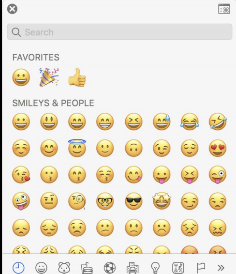
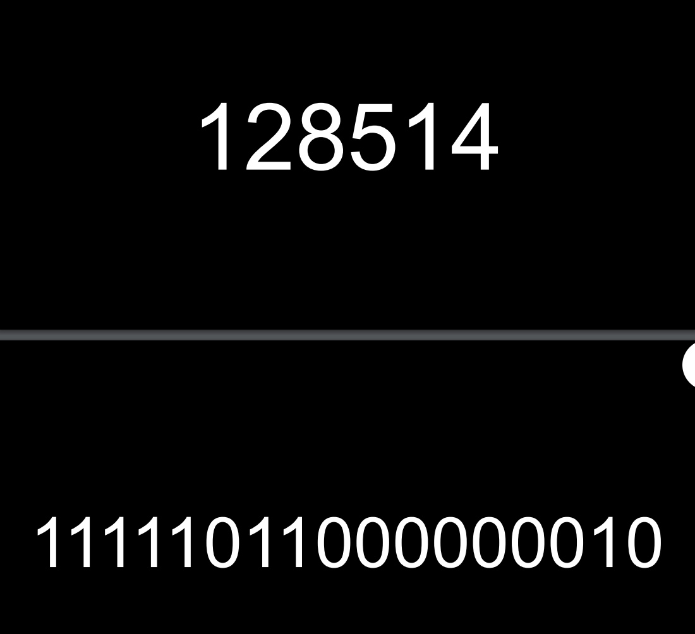
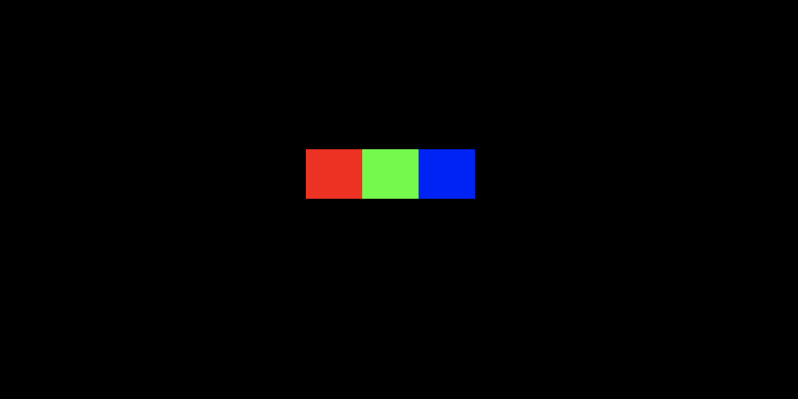
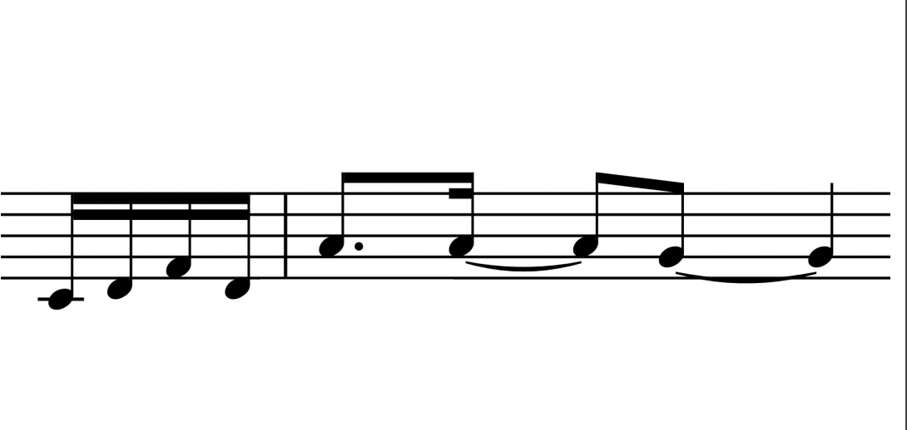
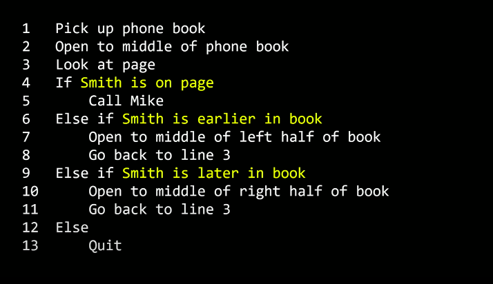
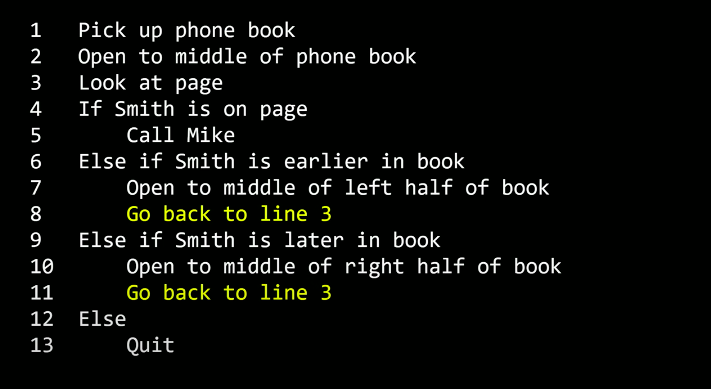

# Ref
[Home page](https://cs50.harvard.edu/summer/2020/weeks/0/)

[pdf](https://cdn.cs50.net/2019/fall/lectures/0/lecture0.pdf)

start : 0530
end : 0630
read : 28 mins

start : 0530
end : 0640
read : 30 mins

Total : 2hr
Actual : 1hr

</img>
* 2/3 never take cs lesson before, feel unsafe is ok 

# Introduction / Computer Science / Representation
* a process of solving problem
</img>

* how you present input and output?
* more generally, how you present information?

## binary
* **BINARY** - what computer prsent infomation

## Numbers
* count people in the room, perple use 單語言, 有就count 1, 沒有就沒有, 用手來比

* people could count, computer only get 0/1 - but they could present image, video, sound, and character!

* `123` means 一百二十三 in our symbol - and we read in a way like below

</img>

* it is just a power system of 10

* then in computer system, they think like that.
</img>

* **BINARY** means somebody understanding information using 2 power system

</img>

* we need more digit :P
* the digit called **bit**
* 1/0 on/off True/False could represnet the idea

</img>

* bytes just 8 bits

</img>

* this is 50
* 晶體管，裡面就是一大堆這種開關XD
* 某個計算機為了表達50，就會在剛剛的這三個位置儲存一點電，那麼他就表達了50
* 真的很好笑XD，互動的部分XD

# What about text and sending email, compose document?
## character
* ok!, how computer represnet character?

* represent as nunber XD
* A - 1, B - 2, C - 3 ?
* they have a dictionary!
* this dictionary is ASCII  

</img>
</img>
</img>

* **ASCII** - American System Code II (美國訊息交換標準代碼)
* well, again, just a well-defined map(dictionary)

</img>

</img>

* if you want to say `HI!`

</img>

# All country around the world?
## Unicode
## and mow day emoji?

</img>

</img>

* They call it **Unicode**
* again, well defined map(dictionary)

* difference ascii use 8 bits, Unicode use 8/16/24/32 bits

</img>

* the most popular emoji sent on IOS to 2019

</img>

* tear smile emoji -> 128514, hahahahaha
* in binary, `11111011000000010`

</img>

# Color? (yellow dots on emoji)
## RGB

* again, years ago, people in a room, you know what, we want to represent color but use `0, 1` only

* if you sent a color point, you are actually sending 3 numbers

</img>

</img>

</img>

# images / gif / video

</img>

* basically N images, with a lot of degit point

# what about music?
## Sound

</img>

* 音符 持續時間 音量

</img>

# the black box
## algorithms

</img>

* a step by step maumal for solving problem

## find a name in a phone book, well sorted

</img>

* binary search

</img>

## Idea, psudo code, function, condition, boolean statement, and loop
* when problem size getting bigger, solving time basically the same.
* intutively, we get twice size bigger problem, we just one more step to solving probelm

## (psudo code) Tansfer this idea into code
* basically no standard format
* use english, or your language, some number, to present your idea

</img>

* it will translate into a language called `scratch`, `python`, `C`
* the yello highlight word call `function`, it is a verb to do someting!

</img>

* Now another highlight word call `condition`

</img>

* The word highlight following condition is called `boolean statement`, just named by a mathmatician Bool

</img>

* the word highlight is `loop`, which make things going again and again.

</img>

## Summary

</img>

## And More!

</img>

* we will use scratch which is develop by MIT lab

## scratch

</img>

you could try it, it is very easy to use :P

</img>

</img>

* Computer Science like start with zero because it means all the digits are off

* computer can do parallelly, can listening a event
* abstraction - make block as function
