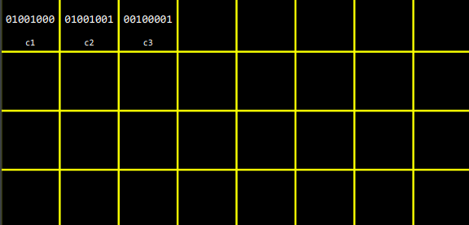
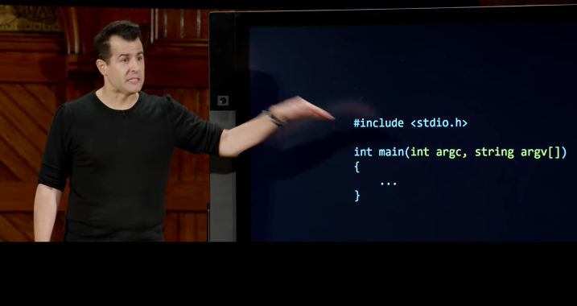

# Ref

[Home page](https://cs50.harvard.edu/summer/2020/weeks/2/)

[pdf](https://cdn.cs50.net/2019/fall/lectures/2/lecture2.pdf)

# Spoilers

* we will go to `python` and we don't compile file anymore!

# Compling revisited

* when we enter `make some_source_code`
* we are actually doing this.

</img>

## Preprocessing

</img>

* actual file will be replace when the 
* `#include <cs50.h>`

 

</img>

## Compiling

* start translate source code to machine code!

</img>

* compiler using `clang` for example

</img>

* which make your code even scarier than C!
* this is something called `assembly code` - 組合語言(a more lower source code to communicate with computer, also  **a little closer the cpu understand**)

</img>

* don't worry! It is still our adorable son. XD

* highlight below we call them instruction

</img>

* Intel / AMD / other companies make CPU, the hightlight code is what CPU understand including moving things, reasding things, copy things, ......
* and we even don't care. haha

## Assembling

</img>
</img>

## Linking

</img>
</img>
</img>
</img>

* That's is how human build up a software!

* long long time ago. people use 0/1 to communicate with computer, then human get tired. they have **assembly**, again, they got tired, they have C, C++, Python, PHP, Ruby!

* the 4 steps are all we simply call it **compiling**

# debugging

</img>

* a very famous computer scientist have a real bug in his noteXD

`help50` in cs50 sandbox

* instead of `make buggy0` , try `help50 make buggy0` , it will help you with shorter message!

</img>

## use CS50 IDE!

* fancier version about cs50 sandbox
* support debugger!
* stopped point - debugger point
* `run debug50 buggy2`
* `help50` ,   `debug50` ,   `check50` ,   `style50`
* talk to the duck - [rubber duck debugging](https://zh.wikipedia.org/wiki/%E5%B0%8F%E9%BB%84%E9%B8%AD%E8%B0%83%E8%AF%95%E6%B3%95)

</img>

* in the future, we even introduce you a design tool which makes you design your code better!

# Arrays

* array is a solution makes our design better!

</img>

</img>

* this is where your data store in when you are - memory, N gigabytes of memory. 

</img>

* visulizing like that, left top - the first bytes, second bytes, third bytes, ...
* char - one bytes
* int - 4 bytes
* long, other, ....
* `how the computer store the information in the program you write?`
* char `use ''` string use `""`
* like

</img>
</img>

* QAs

* what will happend if we divide a int by a float? - it will upcast, transform to a float divide a float.
* if our answer is 99.49, we use `%.1f` , what will we get? - it will upcast : you will get 99.5

</img>

</img>

* [int take 4 bytes(32 bits) to represent](https://www.runoob.com/cprogramming/c-data-types.html)

</img>
</img>

* string is an array of char at this point!
* so string is a data type in cs50 library consist of by an array of char.

## how long should string be?

* as many characters as you need!
* `Hi!` at least 3 bytes
* `Daivd` at least 5 bytes
* string can't reaaly preodained length associated with them.
* we need to tell the computer where our string start and end.
  + in cs50 library, we use double quote "" and null character `\0` (terminating chracter)
  + `\0` - a special symbol - drawing last all eight bits as zeros(like a end symbol)
  + it might looks wasting. we use only 3 bytes in `Hi!` but 1 bytes to end the string.

</img>
QAs :

* is there any memory limitation of string? - short answer : yes, the limitation of the memory
* what happends if you try to type that in hypothetically? - we will come back to this question, but not now.

* start here

</img>

* in memory, no concept to describe up, down, left, right. it store continuously.

</img>

* technically store int, not a string.

</img>

* you can think like that : every chracter is kind of **addressable**
* it means : there is no magic. if you think it is magic. Just something you don't understand.

* but kind of this concept is heavily used in **cryptography**(密碼學)
* [manual page of cs50, check on the cs50 website](https://man.cs50.io/)

# command line arguments

</img>

* in the `main` section. you can also pass

</img>

* two argument, first is integer, second is an array of string.
* first is `the counts of argument` - just like `numbers of scores` ,   `average score array of integer`
* we can implement feature like what clang do
* `help50` ,   `style50` ,   `...50` implement like that!

</img>

* now we can tell,   `void` means no command line argument

</img>

* and what is the return value of `main` function?
  + by default, main return `0` - means all well.
  + and `main` can return non-zero values(like,   `1` ,   `2000000` ,   `-300000` ) - if you check your mac carefully, sometimes it shout out something something `-42` ,   `-3` , blablabla - it is a number which human decide the program to return, we called it `Error code`

QAs:

* what `argc` can't be zero? - the `argv[0]` is the file name by default.

# cryptography!?

</img>

* input your password
* output is something we cant understand
* we called it `encrypted` so to speak.

 
</img>
</img> 
</img>
</img>
</img>
</img>
</img>

* they should use a key to `encrypted` and `decrypted`

# Learning log

session 1
start 1730
end 1830
course 26:00
factor 2

session 2
start 1730
end 1830
course 54.38
factor 2

session 3
start 1715
end 1830
course 80:00
factor 2.8

session 4
start 1220
end 12:55 
course 95
factor 3.6

session 5
start 1415
end 1445
course 107
factor 2.5

total  260 mins (4.3hr)

course 120 mins (2hr)
