# Ref

[Home page](https://cs50.harvard.edu/summer/2020/weeks/3/)

[pdf](https://cdn.cs50.net/2019/fall/lectures/3/lecture3.pdf)

# Week - 3 Algorithm

* momory(random access memory, ram)

</img>

* looking for a number : 7 boxes, each one number in a box. looking for `50`
# Linear Search 

* all the numbers are random

</img>

``` 
pseudocode(english like)
for i from 0 to n-1
  if i'th element is 50
  return true
return false
```

* 就是一個一個找，超慢...

# Binary Search

* dive and conquer solution
* sorted(已經作弊過)
* 從中間切，比大小，再從剩下的，從中間再切

``` 
pseudocode(english like)
if no items
  return false
if middle item is 50
  return true
else if < 50  middle item
  search left half
else if > 50  middle item
  search right half 
```

</img>

* time to solve indicate the worst case

# general way to tell how good algorithm is

## big O

* on the order of 
* $O(\frac{N}{2})$ ~ $O(N)$, because computer scientist usually consider a very big problem, practically, depends on your problem size.

### a cheat sheet

</img>

## big omega

* the opposite of bigO
* big) is essentially an upper bound on how much time n algorithm might take
* bigOmega describe the best cases
* for instance
  + (worst case)linear search take $n$ steps
  + (BEST case)linear search take $1$ steps

* another instance
  + (worst case)binary search take $log_2{n}$ steps
  + (BEST case)binary search take $1$ steps

### a cheat sheet

</img>

### More case on Omega and O

* what's problem and algorithm indicate $\Omega$ and $O$ both $N$? - counting how many boxes

* QAs : Is it better to have a really good omega or a really good O value? - good O - best case is nice to have, but we need to consider the worst case.

* cs50 IDE
* names.c
* number.c
* phonebook.c

# sort

## bubble sort

* sort first then do the search?
* we need to ask a memory lock

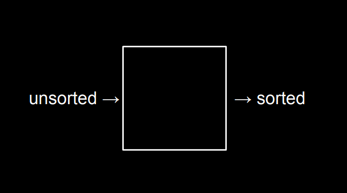</img>

* unsorted -> sorted
* show time with 8 volunteer
* ask 8 volunteer sort thenselves

</img>

* what algorithm sort? 
  + human intuition XD
  + compare with left, if I am bigger, i stay there, if I am smaller, switch
* check [42:00](https://video.cs50.io/fykrlqbV9wM?screen=sPRcgqR8CJw&start=2539)
* this type of search hsas a name called **bubble sort**
* alright, in psudocode

``` 
Repeat n-1 times(because it is the most times you can do)
For i from 0 to n-2
  If i'th and i+1'th elements out of order
    swap them

Time Complexity O(N^2), Omega(N^2)
```

* bubble sort is more time consuming than linear searching and binary searching!
* so can we claim binary search is faster than linear search? - you need to consider time of sorting!
  + and if you want to search it more than 1 times, and we can get benefits from sorting!
* $\Omega(N^2)$ because we cannot tell sorted or not, we are not leaving, we do checking repeatly
* can we do better? - Yes!

## selection sort

[check start at 49:16](https://video.cs50.io/fykrlqbV9wM?screen=sPRcgqR8CJw)
63852741

1. remember the smallest value using a loop
2. swap the smallest and first value(who cares the position, they are random)

   * (swaping is more time friendly) 

3. move to i+1 position, do totally the same thing
4. done

psudocode

``` 
For i from 0 to n-1
  Find smallest item between i'th item and last item
  swap the smallest item with i'th item

Time Compliexity 
bigO

per stpes : n + (n-1) + (n-2) + ... + 1 = n(n+1) / 2

O(N^2)
bigOmega
still O(N^2) 
```

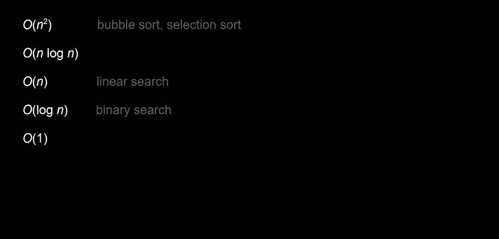</img>
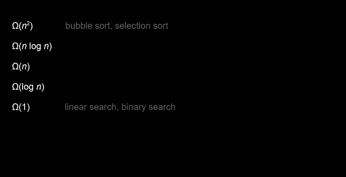</img>

# Can we do better?

add one line to bubble sort, Repeat uitl no swap
make Time Complexity $\Omega(N)$

# sort visualization

* [here](https://www.cs.usfca.edu/~galles/visualization/ComparisonSort.html)

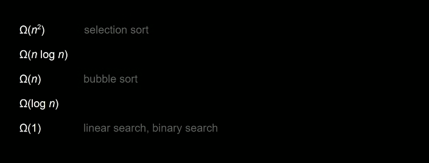</img>

# Intution from binary search

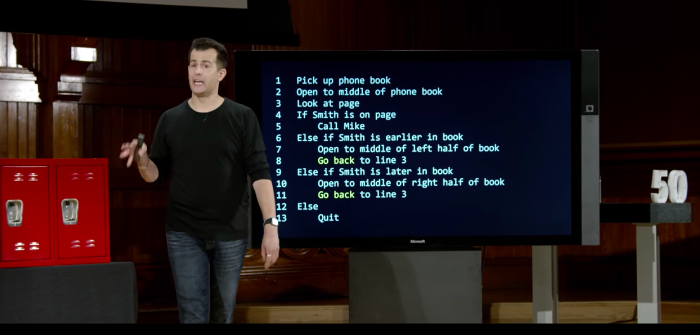</img>

* open to middle of left half of book / right of book is acutally the same action only different size

</img>

# Recursion

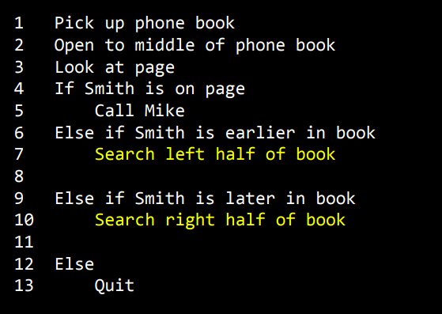</img>
cs50 sandbox
actually a google joke when you searching recusion

# Merge-Sort

* bettern than selection sort and bubble sort fundamentally
* everything in our life are sorted, phone book, text book, your facebook friend, instegram friends, google searching engine!
* it will be a shame of super slow sorting algorithm

* psudocode

``` 
(Stopping condition / Base Case)
if only one item
  return 
else
  sort left half of items
  sort right half of items
  merge sorted halves
```

animation for merge sort
start @ 80

</img>
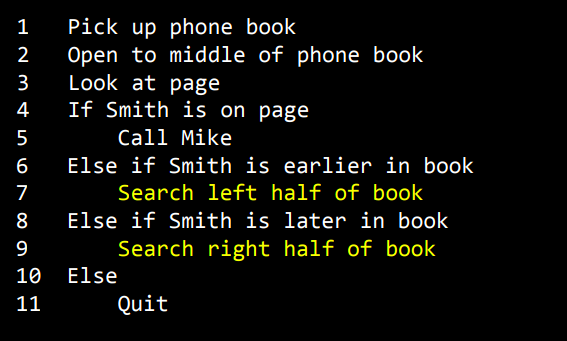</img>

</img>
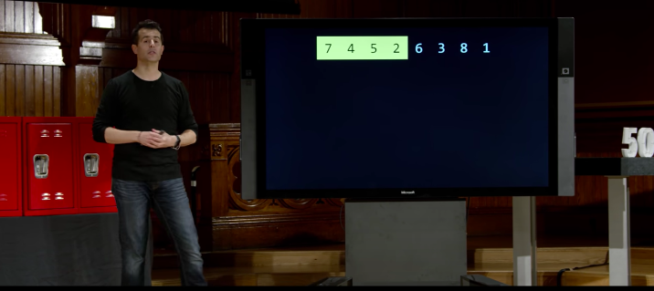</img>
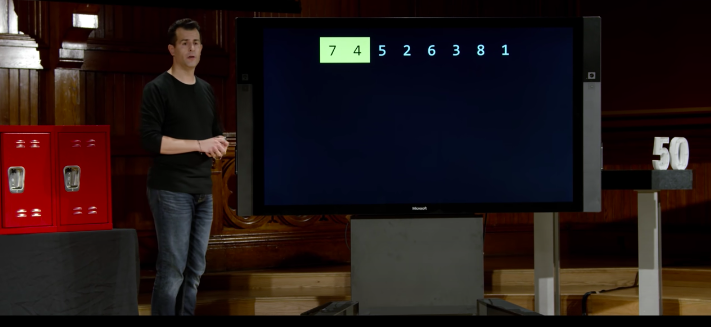</img>
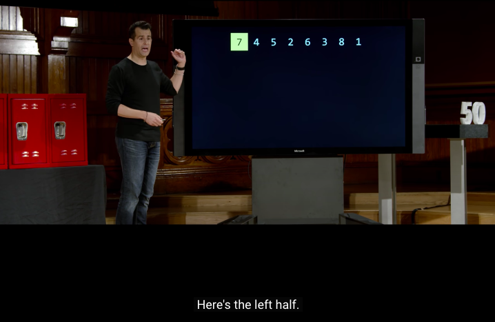</img>

* base case - return

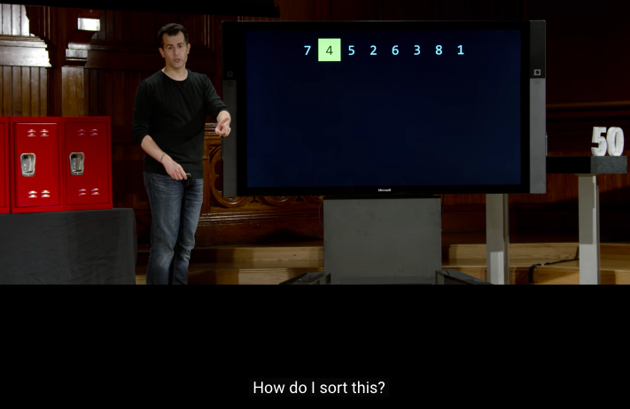</img>

* base case - return

* third step merge

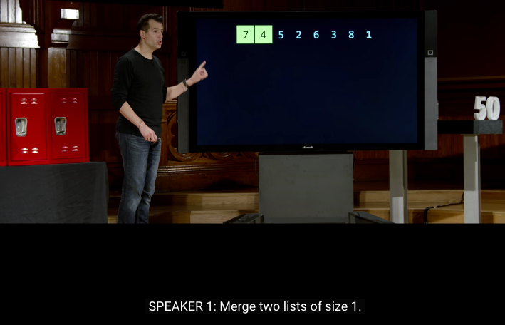</img>
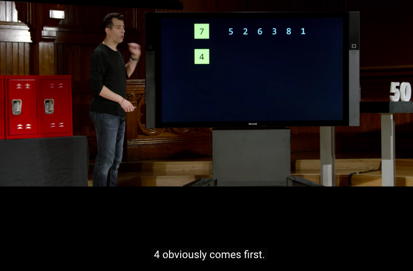</img>
</img>

* another stack merge step

</img>
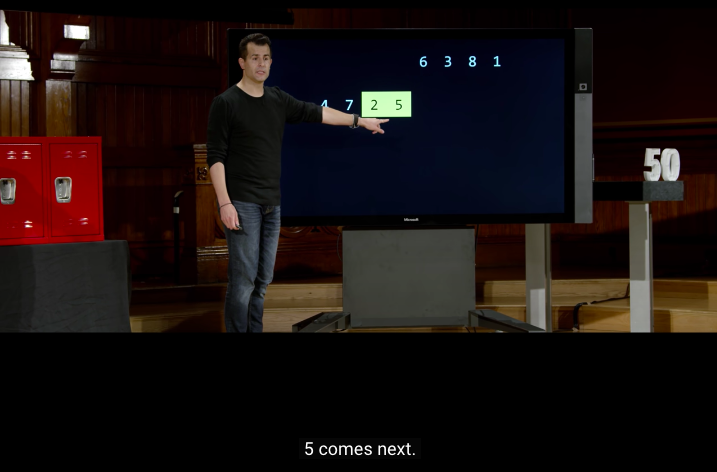</img>

* still need write a sorting
* merge sort is kind of a meta sorting algorithm

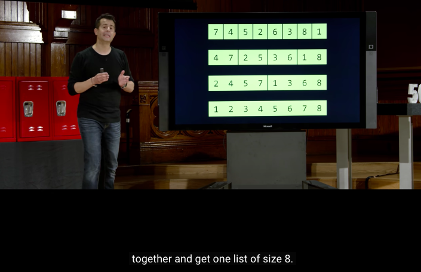</img>

* like a sorting version of binary search
* and it's time complexity $N O(log_{2} N)$
* because
* for width, we need a sorting for $O(N)$
* for the hieght, we dive our array by 2, with is $log(N)$

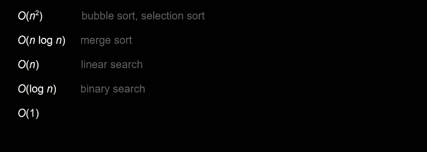</img>

* how about $\Omega$

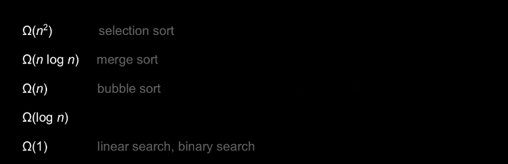</img>

* because it still sort them

# Theta

* if the algorithm have the same upper bound($O$) and lower bound $\Omega$, then we use $\Theta$

</img>

# animation

* $N logN$ make things possible from $o(N^2)$!

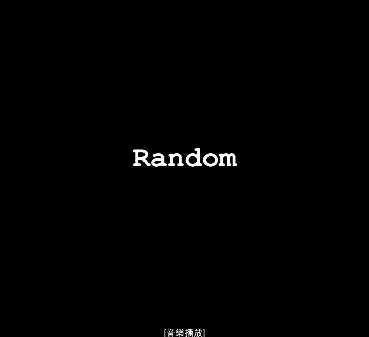</img>

# Stats

start 1730
end 1830
course 25:00
factor 2

start 0120
end 0230
course 48:00
factor 3

start 1730
end 1815
course 60
factor 3

start 1800
end 1830
course 80
factor 1.5

start 1810
end 1840
course 90
factor 4

total  260 mins (4hr)

course 120 mins (2hr)
