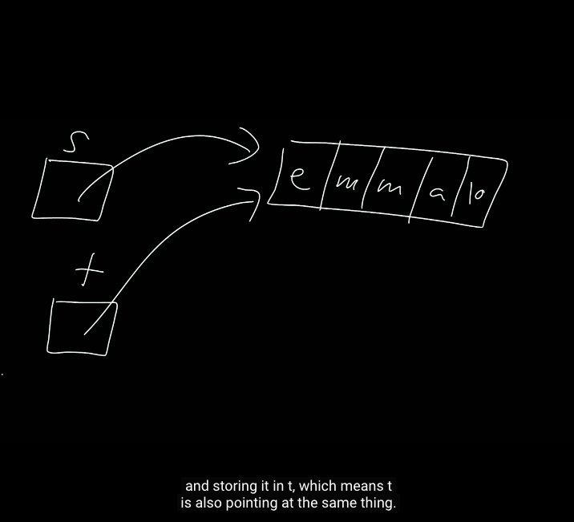

# Ref

[Home page](https://cs50.harvard.edu/summer/2020/weeks/4/)

[pdf](https://cdn.cs50.net/2019/fall/lectures/4/lecture4.pdf)

# Week - 4 Memory

* 這週會講得更機械式的，更系統式的
* 以稍微更不同的方式進行計數(counting)，我們知道了人為所熟悉的10進位制或是2進位制

* the position in the memory

</img>

* 你以為會是這樣計算? 不是
* 記憶體採16進位制
* A -> 10, B-> 11, C->12, D->13, E->14, F->15
* 我們接下來會介紹為什麼會這樣子出現

</img>

</img>

* 255是8bits可以計算的最高值
* 用16進位可以表示成下面這樣

</img>

* Black `000000`
* Red `FF0000`

</img>

* reconsider momory counting

</img>

* But it is very confusing, Do I looking at 10/2/16?
* Human decide to add `0x` as prefix to show we are looking at hexadecimal. make human knows. oh. it is hexode now. no any mathimatical meaning.

</img>

# Pointer & adress

 `adress.c`

</img>

* techniqually, variable take a spot of memory

</img>

</img>

</img>

* the adress of variable will not be the same.
* it is a security decision our morden computer do.

* QAs: if I try to declare `int p = &n;` , what will happend? - compiler will yelling at you. it will realize you are assigning a pointer to an integer.

* our code in visualization

</img>
</img>
</img>

* computer scientist also recommand : `Nerver talk about the specific adress!`
* pointer(mailbox) -> variable(letter)
* if a variable store a pointer
* it will like a treasure game (start 22:00)
* we will see it is a very powerful tool!
* you can see like pointing this variable, pointing another variable, like a family tree.

* QAs : morden computer pointer use int64 long

# String does not exist

 `string s = "EMMA"`

 
</img>
</img>
</img>

* if the computer knows the begin position, and there is a null character.
* now we know that string is a pointer to point the first character

</img>
</img>
</img>

* it is a custom type named string using `typedef`
* all of it, string is a adress of first chracter. null terminator with 8 bits zero
* there is no magic :p
* QA : why `printf("%s")` print all of the string in stead of a single chracter? - `%s` is a special sytanx sugar, it will print all of the sequence until null terminator
* `strcap` !?

</img>

* when `t = s` , actually you are coping a pointer

</img>

* QAs : what if I forget to copy the null terminator? - you might print out many more chracter you actually input. depends on your previous input.
* string in C called char star, not string.

# malloc(memory allocation)

</img>

* `valgrind ./copy`
* memory leaking, bad - `help valgrind ./copy`

</img>

* `free()` - to free a memory given address
* `sizeof()` - dynamically give a memory size of data type

# swap

* stsrt 60:09
* like:

``` 

swap a b

tmp = a
a = b
b = tmp
```

</img>

# memory structure

</img>

1. machine code - compiler 
2. global variable
3. heap (malloc call it to give you memory)
4. ...
5. ...
6. stack local variable call(main, swap, ... anything else your functions)

</img>

</img>

* end of the function call

</img>

* can we pass the pointer(reference), not a copy? - yes

</img>

* QA : when we use `get_string` . is it free the pointer as the last? yes, it will detect whatever you free the memory or not. and do it magically. it is called garbage collection.

</img>

* it is not a best design, if we keep calling malloc, malloc, malloc, and keep calling funcion, function, function, function. it will crash your computer
* if your function is a recurssion function. it will lead to `stackoverflow`

</img>
</img>
</img>

* `heapoverflow` is the other thing. if you keep calling malloc, malloc, malloc, malloc, malloc, malloc, malloc. 
* `bufferoverflow`

# Pointer to FileIO

</img>

</img>

# Stats

session 1
start 1730
end 1830
course 20:00
factor 3

session 2
start 1740
end 1830
course 40
factor 3

session 3
start 2130
end 2230
course 60
factor 3

session 4
start 0940
end 1040
course 95
factor 2

session 5
start 1810
end 1840
course 100
factor 6

total  260 mins (4hr)

course 120 mins (2hr)
