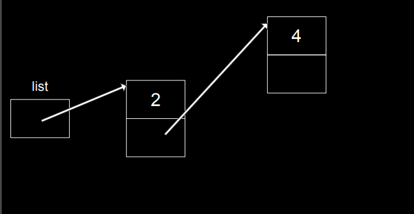

# Ref

[Home page](https://cs50.harvard.edu/summer/2020/weeks/5/)

[pdf](https://cdn.cs50.net/2019/fall/lectures/5/lecture5.pdf)

# Week - 5 Data Structure

start with a buggy example
</img>

``` C
int main(void)
{
    // 建立兩個指標, x, y
    // 這兩個指標為一個整數型態
    int *x;
    int *y;

    // 收集int所需要的bytes, 4 bytes，第一個記憶體位置放在x這個變數
    x = malloc(sizeof(int));

    // 去到x的位置，放42這個數字
    *x = 42;
    // 這一行是bug，因為你沒有跟系統要記憶體
    // might some sgementation fault
    // 甚至不知道這個記憶體指向的指標在哪裡
    *y = 13;

}
```

</img>

* 如果我們這麼做，那麼42就不見了，變成13

* pointer fun! start from 06:18

# A problem

* we want to add forth variable in a previous declared array with fixed size 3
* then we want to do that

</img>

* but in the memory space. we will face a problem like that

</img>
</img>

* how about re-located additional emelents down to the available memory space
* 想像中午們會這麼做，下面新的空間開更多的記憶體，把原本的複製一份，再給新的賦值 - not a best strategy
  + such a algorithm when we soliving a problem name insert a value in an array $O(N)$

</img>

# cs50 sandbox

* 實際上array就是一個pointer
* 考慮一個裝3個int的array，實際上就是一個記憶體位置
* 連續儲存3塊，都是 4 bytes 的 moemory chunk

* QAs : Do not assign new pointer to the list and lost control of your original memory chunk. it will be a zombie memory.

* QAs : if wI assign a pointer to an integer, will it fail whem I assign this pointer to array? - No, because array is just a chunk of memory. you can access using `[]`

## Data Structure

Everything we're talking avout today will be these three features of C

``` 
struct -> self-defined data type.

. -> access a property of structure.

* -> dereference operator that aloows you go to a chunk of memor by way of this thing called a pointer.

```

# Linked-List

 `Fix-array`
   - drawback 

    if you want to extend it. you need to ask for more memory. copy old to the new one. add the new components.

   - advantage

    we can index it easily. 

</img>
</img>
</img>
`NULL == 0x0` hexdecimal zero

</img>

## Implements

</img>
</img>

* but you cannot use a node inside a node. it will not exist when you create it.
* so we do that. C allow us to do that.

</img>

struct will take first name as formal name
last name as nick name
here we called both of them : `node`
cs50 sandbox!

### Another idea of linked-list implements

* initially will be empty

</img>
</img>
</img>
</img>

 `(*n).number = 2;`
 go to the address. there is a custom dtype. we want the attribute `number`
 and it is too ugly to read. There is a syntax sugar `->`
 `n->numver = 2`
</img> 
</img>
</img>
</img>
</img>

* what if we want to store value in a sorted order?

</img>
</img>

* if we point one, 2, 4, 5 will be memory leak which is bad.

* do it using two steps

</img>
</img>

* QAs : n is a pointer(address), `*n` is a node, then we need `n->number` , because you cannot do `n.number`
* 5 volunteers to demonstrate the linked-list

start 51:56 - 57:21
what to insert a node at any position of exist linked-list to avoid memory leak

* we have gained the ability to add dynamically to the list using linked-list

* we don't need to do a resize, copy, work when we want to insert an elements in a list.

* any downside of a linked-list?
  + random access. 
    - we need to following the existing path, combine a condition we give. then find a great spot.
    - we use random access to do a binary search. every time we use a linear checking approach to search something.

</img>
</img>

* any benefit?
    - reduce space complexity from $O(N)$ to $O(1)$ when growing/shrinking a value to a list
    - time complexity still $O(N)$ when inserting a value

# Family Tree!

what if we use the linked-list structure in two domension!?

Binary Search in one dimension picture
</img>
Actually we can think about it in two dimension!

</img>

* It's kind of like a linked list
* we use more!

</img>

* Binary search tree
* Guess what feature we just got back?
* searching in $O(logn)$ !
* but still, we have the flexibility to insert elements without copying something.
* This structure is recursively defined!

</img>

* recuresive way to do binary search for input tree!

</img>

* beautiful! now insert and search both in $O(log n)$

* the tree structure nowdays will rearrange the pointers to make your tree balanced. not lanky!
* then make the worst case is almost $O(log n)$

## Hash table

* what if there is a data structure can make inserting, searching in $O(1)$, oh my god. that's so good!

* hash table is an array and linked-list inside of it.
* the goal at hand is to keep track efficiently of like a name tags.
* instead of searching in whole array. we give you an name tag. you can follow the name tag and just go to the bucket.

</img>

 `0 ~ 25 switch to A-Z`
</img>
</img>

in hash-table, array is conceptually vertical
horizontal using linked-list.

then our Harry will ber second element in `H` index bucket.

when we are searching, there is only two elements in the bucket. still in $O(1)$, not $O(N)$

</img>

this situation call `collision` , in computer science, you need to deal with this problem somehow. now we use a linked list approach to deal with it.

and the `A-Z` stuff here we called a hash function.

### Hash function

get an input and decide which bucket it should be put in.

in our case now. our hash function is `first letter`
  + simple
  + efficient
  + small array we use

since we use array. 
the hash function works visually like that

</img>
</img>

Problem? - there might be more name with the first letter

Corner case? - all the first letter of the name is `H` , worst case is $O(N)$

</img>

* how about first two letters? - `26x26 buckets`
* reduce collision, using more space for an array.

</img>

</img>

</img>

* what is an evolution of this idea? - three letters, unfortunately, `26x26x26` might be too large
* but still, if we looking at the corner case. worst case still $O(N)$
* if we need, we can design some magically hash function to keep the uniqueness all the time. 
* In real world computer science. like `Python` . It will deal with it in the background.
* Hash table is a $O(N)$ algorithm. but in the most scenario. it cost only $O(1)$ of time.

# trie

* this data structure use a lot of memory but offer actual constant time for searching.
* a tree which the node is an array.
* Computer scientists over time have beem kind of clever taking this idea, that idea mashing them together and creating some monster data structure. but that gives you some saving of time or space!

* Hagrid -> searching like that.

</img>

* end at `d`
* if we store two name `Hagrid` , `Harry` in  the trie structure. it will like that
* the sharing letter will be that same in the array.

</img>
</img>
</img>

* tree above is stroing `Hagrid` , `Harry` and `Hermione`
* searching - $O(1)$ actially, not average. there is a upper bound of the length of names.
* the memory - space complexity. suppose we have $N$ names, max lenth of names is $k$
* we will use 26 x $k$  x $N$ array space.
* though they are sharing some memory.
* we can say space complexity cost $O(kN)$

# Queues

* 唸作 `cue`
* it is a data structure that is FIFO(first in , first out) - 基本上跟排隊一樣
* the oppisite data structure called LIFO(last in first out)
* there is two operations in Queues
  + enqueue - get in line
  + dequeue - get out of line

# Stacks

* it is a array using LIFO fashion. 
* like the trays getting in dining room.
* we put first on the buttom, get last on the top.
* even though it i s now really fair for the trays. but it doesn't matter : P
* what's the application in the real-world?
  + your gmail inbox
* two operation in Stacks
  + push - put thing to the Stack
  + pop - take out thing to the stack

# Dictonary

* it is an abstraction on the top of hash table
* hash table get physical bucket using array and linked-list
* Dictonary have key and values
* it is a smarter hash table using string to get a value

</img>

* Harford assignments taking back using a dictionary :p

# Summary

* using the idea today. `aray` and `linked-list` . you can image a lot of block could be built.
* linked-list - using a pointer with value
* tree - using two dimensional linked-list
* hash table - using a array with linked-list
* trie - using a tree which node is an array
* Queues, stack using array with FIFO or LIFO fashion
* Dictionay - using a string flavor on the top of hash table

# Stats

start 1745
end 1845
course 30
factor 2

start 1810
end 1830
course 40
factor 2

start 1730
end 1830
course 60
factor 2

start 1800
end 1830
course 70
factor 3

start 0010
end 0050
course 80
factor 4

start 1600
end 1700
course 90
factor 4

total  240 mins (4hr)

course 120 mins (2hr)
