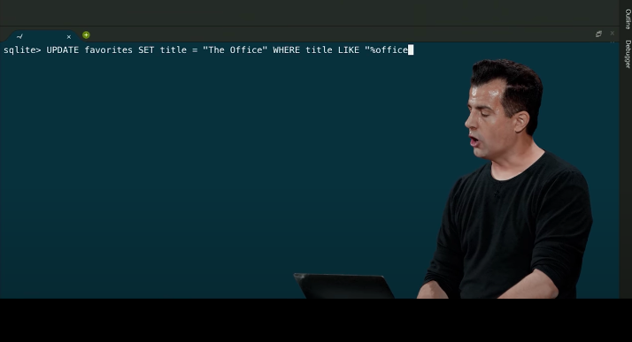
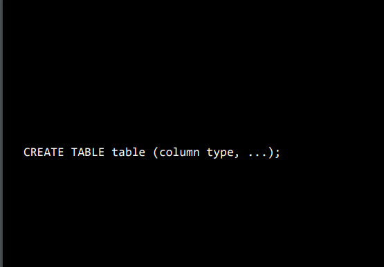

# Ref

[Home page](https://cs50.harvard.edu/summer/2020/weeks/7/)

[pdf](https://cdn.cs50.net/2019/fall/lectures/7/lecture7.pdf)

# Week - 7 SQL

Structure Query Language

* an application to store data - database
* start from survey

</img>

* use dict(hash table) in python to count data with keys and values.

* kinda of messy(tedious) code in python, in SQL

# sqllite3

</img>

* command line tools for mini database
* very useful if you just want to see some stats in command line enviroment

# relational database

INSERT
SELECT
UPDATE
DELETE

</img>

# data type

* fancy new to call a new sheet!
* the data type of sql 
* BLOB
  + (Binary Large Object)
  + typically you won't use it, but if you want to store binary data, just use it.
* INTEGER
  + smallint
  + intger
  + bigint
* NUMBERIC
  + boolean
  + date
  + datetime
  + numeric(scale, precision) - you can specify how may digits you want before the decimal point
* REAL
  + real
  + double precision
* TEXT
  + char(n)
  + varchar(n) - an upper bound of columns
  + text
* why when we use the web-based applicaiton, thr button not work suddenly? - becuase the backend is using SQL(they had to decide the max length of text of input, so when you put to much into the database, it will slow you down to avoid some kind of attack)

# functions

* a lot, INSERT, SELECT, AVG, COUNT, DISTINCT, SUM, ... LIKE(very handing for matching)

</img>

* `%` placeholder - means anything - %office% (blablabla**office**blablabla) 
* WHERE, LIKE, LIMIT, GROUPBY, ORDER BY, JOIN, ...

</img>

</img>

* use sqlite3 to do data cleaning

* most dangerous!!!

</img>

</img>

* what's might it got? - there might be another tv shows containing `friends` but not `friends` , you can search on IMDB!

# IMDB datasets

* IMDB provide dataset as `TSV` file(Tab-Separated Values) - they decide use tab instead of comma to seperate the file

IMDB : `https://www.imdb.com/`
# Hands on command line SQL

# Stats

start 1745
end 1800
course 30
factor 0.5

start 1730
end 1830
course 75
factor 1.2

start 1930
end 1945
course 90
factor 0.5

total  60 mins (1hr)

course 120 mins (2hr)
