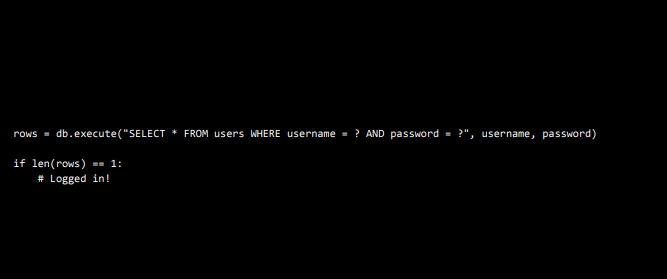

# Ref

[Home page](https://cs50.harvard.edu/summer/2020/weeks/7/)

[pdf](https://cdn.cs50.net/2019/fall/lectures/7/lecture7.pdf)

# Week - 7 SQL

Structure Query Language

* an application to store data - database
* start from survey

</img>

* use dict(hash table) in python to count data with keys and values.

* kinda of messy(tedious) code in python, in SQL

# sqllite3

</img>

* command line tools for mini database
* very useful if you just want to see some stats in command line enviroment

# relational database

INSERT
SELECT
UPDATE
DELETE

</img>

# data type

* fancy new to call a new sheet!
* the data type of sql 
* BLOB
  + (Binary Large Object)
  + typically you won't use it, but if you want to store binary data, just use it.
* INTEGER
  + smallint
  + intger
  + bigint
* NUMBERIC
  + boolean
  + date
  + datetime
  + numeric(scale, precision) - you can specify how may digits you want before the decimal point
* REAL
  + real
  + double precision
* TEXT
  + char(n)
  + varchar(n) - an upper bound of columns
  + text
* why when we use the web-based applicaiton, thr button not work suddenly? - becuase the backend is using SQL(they had to decide the max length of text of input, so when you put to much into the database, it will slow you down to avoid some kind of attack)

# functions

* a lot, INSERT, SELECT, AVG, COUNT, DISTINCT, SUM, ... LIKE(very handing for matching)

</img>

* `%` placeholder - means anything - %office% (blablabla**office**blablabla) 
* WHERE, LIKE, LIMIT, GROUPBY, ORDER BY, JOIN, ...

</img>

</img>

* use sqlite3 to do data cleaning

* most dangerous!!!

</img>

</img>

* what's might it got? - there might be another tv shows containing `friends` but not `friends` , you can search on IMDB!

# IMDB datasets

* IMDB provide dataset as `TSV` file(Tab-Separated Values) - they decide use tab instead of comma to seperate the file

IMDB : `https://www.imdb.com/`
IMDB interfaces : `https://www.imdb.com/interfaces/`
`title.basics.tsv.gz` : we download this dataset and using `vim` and `sqlite` to get some juice in the datasets.
IMDB data files : `https://datasets.imdbws.com/`
* you can use click to download or copy the link using wget
* `gunzip xxxxxxx.gz`

### data wranging using python...

``` 
(py_37_ds) YuLong@wangyuxuandeAir:~/Desktop/Working_Area/cs50/data$ wc -l title.basics.tsv
7084214 title.basics.tsv

```

1. 700w+ rows

2. chop tv_shows only using python(可以設定read_csv - delimiter='\t')，csv module裡面也有

3. using `SQL` wrapper in `python`
</img>

* `VALUES(?, ?, ?, ?)` INSERT query, the placeholder will eat the rest parmas in the following arguments. Basically same thing like `%s` in C.

* converting data using python, then using sqlite3

``` 
(py_37_ds) YuLong@wangyuxuandeAir:~/Desktop/Working_Area/C_101/chp7/src7$ sqlite3 shows3.db
SQLite version 3.32.3 2020-06-18 14:00:33
Enter ".help" for usage hints.
sqlite>

```

SELECT * FROM shows
SELECT COUNT(*) FROM  shows

``` 
sqlite> SELECT COUNT(*) FROM shows;
153331

sqlite> SELECT * FROM shows WHERE primaryTitle = "The Office";
tt0112108|The Office|1995|Comedy
tt0290978|The Office|2001|Comedy,Drama
tt0386676|The Office|2005|Comedy
tt1791001|The Office|2010|Comedy
tt2186395|The Office|2012|Comedy
tt8305218|The Office|2019|Comedy

sqlite> SELECT COUNT(*) FROM shows WHERE genres LIKE "%Comedy%" AND startYear = 2019;
1593

```

`.db` file 可以視為一個資料庫，裡面可以放各種資料表

# Normalization(資料正規化)

one to many
</img>
ERD(Entity Relation Diagram)
</img>
DB Brower for mac

# GUI interfaces

* DB Browser for sqlite
* Nested Query - just follow your analytics logic like

``` 
SELECT * FROM shows WHERE id IN(
  SELECT show_id FROM stars WHERE person_id = (
    SELECT id FRMO people WHERE name = "ABC"
  )
)
```

* you will check the id of abc, and konwing what shows he take, finally the all shoes information of a sepeicfic chracter "ABC"

``` 
SELECT title
FROM people JOIN stars ON people.Id = stats.person_id JOIN shoes ON syars.show_id = shows.id
WHERE name = "ABC"
```

* they are the same result but following different mindflow. but it will be more slower because we are selecting on a big joined table(nested query will be more faster but less readable)

* is there a GUI interface for mysql?

# Key and Index

| name        | explaination               | title |
|-------------|----------------------------|-------|
| Primary Key | make you column row unique | conte |
Foreign key|same id appears in some other table(like person_id, show_id, they are they key to be joined)||
Unique|||
Index|make searching more effiency||

* we noticed that `select * from ` is a seaching behavior - a cool thing you got in sql is when you assign a primary key, SQL will build a very fancy data sturcture call `index`

## Index

Tree-like Structure - allow you searching your data effiently, it use B-Tree

</img>
not a binary tree, a node a splits one, two, or more than 3 child nodes. the tree is construct for very shllow depth. which will speedup your searching.

* also , you can create your own index column.

``` 
CREATE INDEX person_index ON stars(person_id);
```

</img>

* it will take a while, in this case 150 million rows using 1.6s
* let's create more

``` 
CREATE INDEX show_index ON stars (show_id);
CREATE INDEX name_index ON people (name);
```

* instead of searching in list-like structure, it will searching in tree-like structure.

* run the same query!

``` 
SELECT title
FROM people JOIN stars ON people.Id = stats.person_id JOIN shoes ON syars.show_id = shows.id
WHERE name = "ABC"
```

2000 ms -> 8ms (awesome!!!!!)

this is why google, facebook, microsoft, who have very large data. they will not store their data only, they will index their table intelligently!

### the price we just paid in CREATE INDEX

* race condition(all the guys can visit the same values)

</img>

* 2 person click `like` when the likes = 5, what will happened?
* we will not cover the solution, but the keyword is 

</img>

# SQL injection

</img>
</img>

* user input comment the password part, and make your database select all user where username = `malan@harvard.edu` , and the result might pass the login condition.
* Now you login as `malan@harvard.edu` WITHOUT password

</img>

* so, please use place holder based library not native string for query excuting.

# Additional info

* [DB Browser for SQLite](https://www.minwt.com/website/server/21758.html)
* [[Mysql基本觀念] primary Key / Index / Unique差別](https://miggo.pixnet.net/blog/post/30862194)
* [用 SELECT ... FOR UPDATE 避免 Race condition](https://blog.xuite.net/vexed/tech/22289223-%E7%94%A8+SELECT+...+FOR+UPDATE+%E9%81%BF%E5%85%8D+Race+condition)

# Stats

start 1745
end 1800
course 30
factor 0.5

start 1730
end 1830
course 75
factor 1.2

start 1930
end 1945
course 90
factor 0.5

total  60 mins (1hr)

course 120 mins (2hr)
