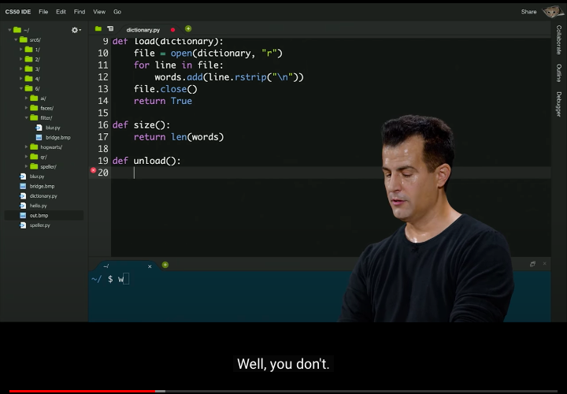
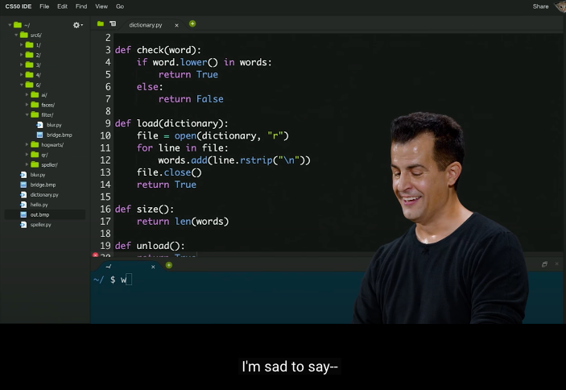
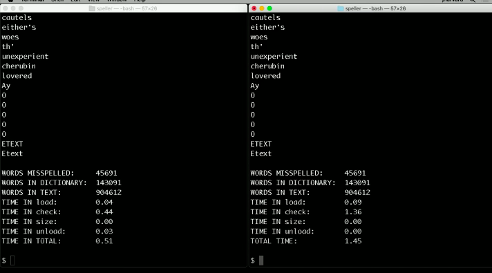

# Ref

[Home page](https://cs50.harvard.edu/summer/2020/weeks/6/)

[pdf](https://cdn.cs50.net/2019/fall/lectures/6/lecture6.pdf)

# Week - 6 python

* we hope you have a ability to learn new language

* use scratch to mimic the program

# python

* no more semicolomn
* no more standio
* no more type of variable
* do the same thing but very simple
* f-strnig

# compiler

 `python hello_world.py`
source code -> your functionality

# implementation

</img>
</img>

* super easy. no need to free memory. powerful loop

* same program

</img>

# python features vs C features

* paid price, python is slower 1.45s vs 0.5s
* if you're doing your homework. you don't care!
* if you are searching million of people. if will take you more server for cost. you shoud use C!
* `src6` C code vs python code 
* is any thing in c could be done in python? - no, some language are build or better suited for certain domain.
* for example, if you want to using C to build a web service you will be exhausted, but in python, ruby, Java, there are a lot of features to help you.
* the fact is like language like python doesn't have pointer, because it is so easy to make a mistake of pointer

* no need to write a main funtion in python. you just start writing your code.
* in python, no portotype, use a module instead.
* Pythonic code - simple, but maybe the best idea to maintain.
* there are no `++` operator in python
* there are no `do while` syntax in python
* default python using positional arguments and keyword arguments, C use positional arguments only
* be carful about default argument

* input will always return `string`
* overflow? - there is no upper bound in python numbers, some other guy deal with the problem
* list - no more `malloc` and `realloc`
* `for in` in Iterable
* `argv` in `sys` -> `from sys import argv`
* `exit` in `sys`
* `if ... in` means a loop $O(N)$
  + what is the time and space complexity in python syntax sugar? - you can read python documentation
* `dictionary` - string abstraction with hash table 
* `if ... in iterable` - worked in a dictionary.
* double quote ans single quote are the same, can be use for both. in C, double for string, sinlge for char
* python do strnig compare using `==` , C do that using `strcmp`
* swap two values

`x, y = y, x` , in C, you need `*a, *b, tmp`
75

# Regular expression

* there is a feature C do not have, but in Python, Bash, Java, ... there is!

# AI

* using Google speech API and Google face API!
* face recogntion
* QR code - straight-forward loading link by QR Code!

start @ 1:43:00

# Stats

start 1745
end 1800
course 30
factor 0.5

start 1730
end 1830
course 75
factor 1.2

start 1930
end 1945
course 90
factor 0.5

total  60 mins (1hr)

course 120 mins (2hr)
