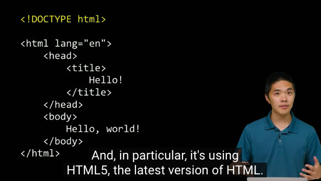

# Ref

[Home page](https://cs50.harvard.edu/summer/2020/weeks/8/)

[pdf](https://cdn.cs50.net/2019/fall/lectures/8/lecture8.pdf)

# Web Programming HTML CSS JavaScript

* send bytes string to another computer
* explaining by web browser
  + it read html, css, js

# HTTP

How computers and othet devices communicate with one another?

* One send message, another get response from another(emails, web pages, char messages, or something like that.)

How they communicate?

* they have standardized on a set of protocals, protocals have names!

## TCP/IP

Transmission Contorl Protocol / Internet Protocol

`realworld` -> `Internet`

`physical address` -> `ip address`

`新北市永和區xxxxxx` -> `#.#.#.#`

# IP destails

## IPv4 and IPv6

from 0.0.0.0 to 255.255.255.255(8 bits, 8bits, 8 bits, 8 bits)
we have count as high as 4 billion address avalible address on the internet

**32-bit addresses called IPv4**

on now days, it is not enough!

we have **128-bit addresses called IPv6**

IPv4 is still common, but many devices now are transitioning to IPv6

IPv6 is like `1079:0BD3:6ED4:1D71:414B:2E2A:7144:72BE`

# Ports

how to distinguish between all these different types of packets? (email/web page/File Transfer)
 `we assign each of the different services of imformation a number`

| Service | Port | explaination  |
|---------|------|---------------|
| FTP     | 21   | File Transfer Protocol |
| SMTP    | 25   | email         |
| HTTP    | 80   | web page      |
|many other!||

# adress + functionality

something like that
 `1.2.3.4:80`

you want to send message to `1.2.3.4` , you sending a web page from one computer on the internet to another computer on the internet

# Alias(Domain Name System DNS)

But we're not really typing IP addresses to visit a webpage on the Internet!
you are typing `URL` like http://www.example.com
it is a one to one mapping asystem  called DNS
why this? because it is much easlier to memorize.

| URL         | IP Address    |     |
|-------------|---------------|-----|
| google.com  | 172.217.7.206 |     |
| harvard.edu | 23.22.75.102  |     |

**DNS** is a bunch of servers. they know for any particular URL what IP address does it correspond to.

when you type `google.com` on your browser
your browser can check with DNS server.
DNS server will return : oh it is `172.217.7.206`

# HTTP exalined again

`http://` www.example.com
It standing for hyptertext transfer protocol
It is like the content in your email!

the content you are sending is like that

I'm tring to get a webpage.

``` 

GET / HTTP / 1.1
HOST : www.example.com
... 

```

HTTP/ version
HOST : the guy you want to communicate with.

what might I get back?

``` 

HTTP/1.1 200 OK
Content-Type : text/html
```

HTTP / version
status code : 200 (everythnig is OK)
content-type is what you get : a html page.

**HTTP status code**

| Status Code | Description           |   
|-------------|-----------------------|
| 200         | OK                    | 
| 301         | Moved Permanently     |      
| 403         | Forbidden             |      
| 404         | Not Found             |      
| 500         | Internal Server Error |      

# Developer tools

* a.k.a 開發者工具
  + Network - tab
    - Request Header - the information I send to google.com
    - Response Header - the inofrmatio I get from google.com
      - view source

``` 

可以看到，使用HTTP 1.1版本的協議
status code 為 301，表示我們被重新定向到別的網頁
HTTP/1.1 301 Moved Permanently
Location: http://www.google.com/
```

* we type `google.com` where have I been redirected to? - I type `google.com` and we have been redirected to `http://www.google.com`
* www means world wide web
* take a look at name `www.google.com`

``` 

我們仍然被重定向，現在重定向到 https://www.google.com/
HTTP/1.1 307 Internal Redirect
Location: https://www.google.com/
```

* https: s standing for secure.

* take a look at `https://www.google.com/`

``` 

Request URL: https://www.google.com/
Request Method: GET
Status Code: 200 
Remote Address: 
```

# HTML

</img>

pass this part, go to chp9

# Additional metirials

[IPv6](https://www.ithome.com.tw/tech/92046)
[TCP/IP, HTTP revisted](http://linux.vbird.org/linux_server/0110network_basic.php#whatisnetwork_osi)

# Stats

session 1
start 1745
end 1800
course 30
factor 0.5

session 2
start 1730
end 1830
course 75
factor 1.2

session 3
start 1930
end 1945
course 90
factor 0.5

total  60 mins (1hr)

course 120 mins (2hr)
